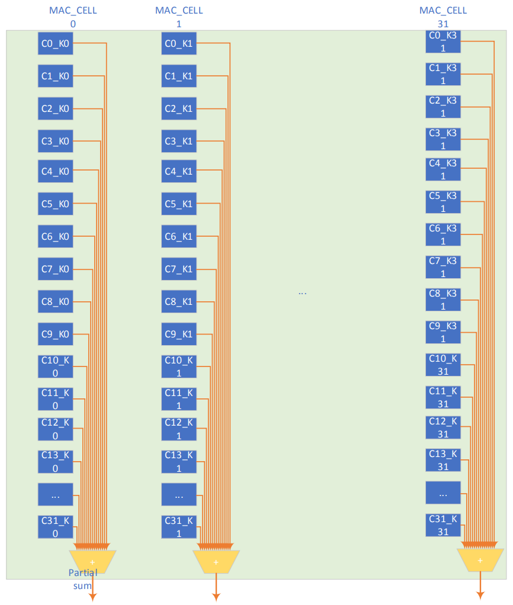
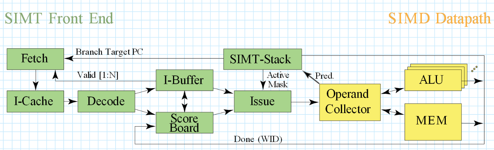
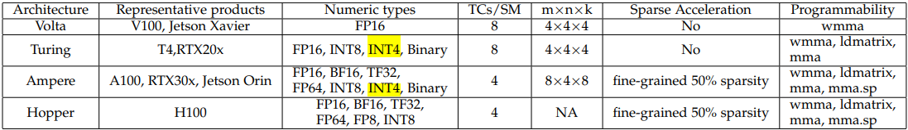
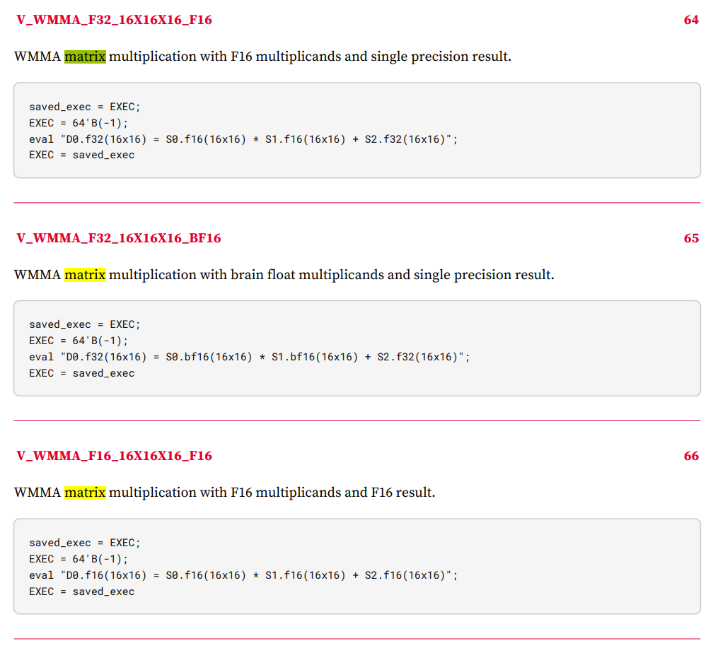
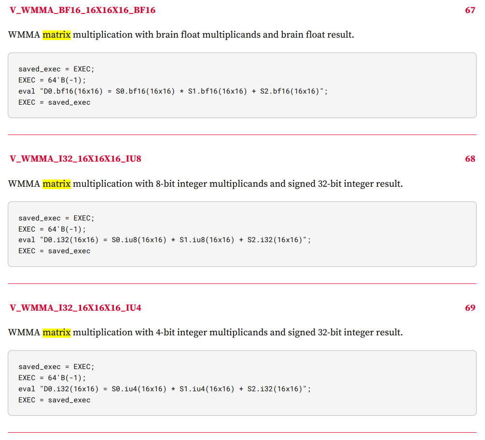
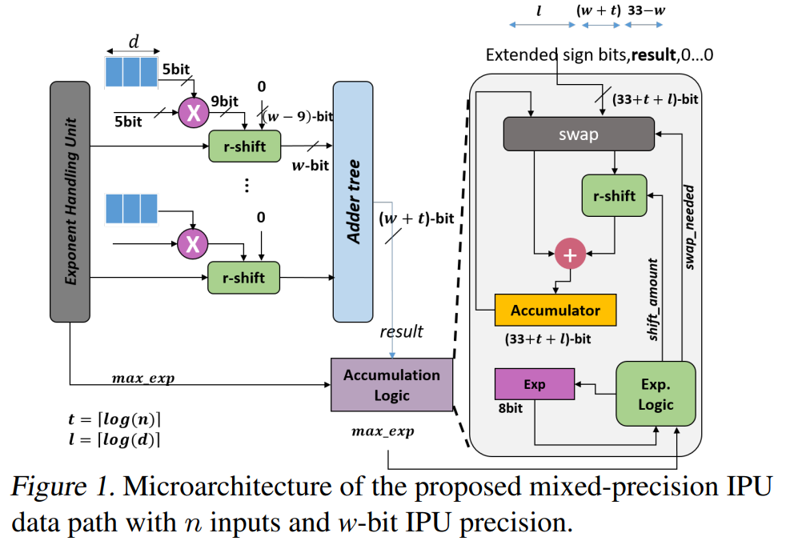
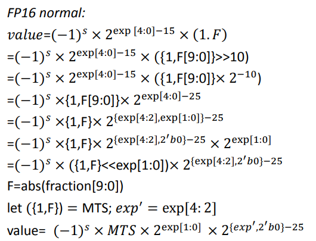

Author：马鸣远  
Date：2023/06/21

# Tensor core 作为SM的执行单元

Tensor core本质上是乘加阵列，支持特定的运算指令，拥有单独的数据寄存器。

支持不同算法（卷积、矩阵乘法）更多的工作在于合理定义数据存储和加载的顺序。

# 主流架构

NV的GPU兼顾训练和推理，训练会使用更高的精度，推理对精度要求没有那么高，所以tensorCore支持的数制很丰富；从4th-gen删掉了int4/int1，增加了fp8（相比fp16，算力翻倍，精度损失可接受）  
可见在推理应用上，int4和int1已经不适用（应该是精度不够吧），追求更高的算力，为了支持transformer模型（对算力需求不是一般的高），弄出个fp8，这也算是业界认可的一个方向。

[2206.02874.pdf (arxiv.org)](https://arxiv.org/pdf/2206.02874.pdf)：

此外，NV的娱乐系列ada架构支持int4，L40 GPU似乎把ada架构带到了服务器领域。ada架构并不是hopper的演进版本。  
[nvidia-ada-gpu-architecture.pdf](https://images.nvidia.cn/aem-dam/Solutions/geforce/ada/nvidia-ada-gpu-architecture.pdf)

AMD RDNA3的matrix core units拥有详细的spec，精确到bit编码  
["RDNA3" Instruction Set Architecture: Reference Guide (amd.com)](https://www.amd.com/system/files/TechDocs/rdna3-shader-instruction-set-architecture-feb-2023_0.pdf)

而NVIDIA虽然未明确地给出指令集spec，但通过一些发布的展示、网上的博客、以及一些cuda编译器（例如开源的TVM）可以看到ptx层级的伪指令

# 低精度计算单元微架构

我们可以通过对计算数的分析，得到复用硬件资源实现不同精度的整数、浮点乘法和累加等操作的解决方案。一般而言，不同精度整数的计算通过以最低精度计算为base、更高精度经过多次iterations和移位实现。当然，iteration可以是空间或时间上的并行性。

整数和浮点的复用，需要经过更详细的编码分析，例如可以实现FP16和int16共用int16乘法器

