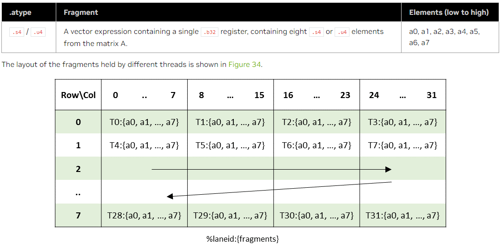

Author：马鸣远  
Date：2023/06/25

# Warp Level Matrix Multiply-Accumulate Instructions（关注int4）

## 矩阵形状

<table>
 <tr>
     <th>Instruction</th>
     <th>Sparsity</th>
     <th>Multiplicand Data-type</th>
     <th>Shape</th>
     <th>PTX ISA version</th>
 </tr>
    <tr>
     <td>wmma</td>
     <td>Dense</td>
     <td>Sub-byte integer - .u4/.s4</td>
     <td>.m8n8k32</td>
     <td>PTX ISA version 6.3 (preview feature)</td>
 </tr>
 <tr>
     <td rowspan="2">mma</td>
     <td rowspan="2">Dense</td>
     <td rowspan="2">Sub-byte integer - .u4/.s4</td>
     <td>.m8n8k32</td>
     <td>.PTX ISA version 6.5</td>
 </tr>
 <tr>
     <td>.m16n8k32 and .m16n8k64</td>
     <td>PTX ISA version 7.0</td>
 </tr>
    <tr>
        <td>mma
        <td>Sparse</td>
        <td>Sub-byte integer - .u4/.s4</td>
        <td>.m16n8k64 and .m16n8k128</td>
        <td>PTX ISA version 7.1</td>
    </tr>
</table>

## 数据类型

对于整数矩阵乘累加运算，两个被乘数矩阵（A 和 B）必须具有相同数据类型的元素，例如均为signed int或均为unsigned。

<table>
 <tr>
     <th>Data-type</th>
     <th>Multiplicands (A or B)</th>
     <th>Accumulators (C or D)</th>
 </tr>
    <tr>
     <td>Sub-byte integer</td>
     <td>both .u4 or both .s4</td>
     <td>.s32</td>
 </tr>
</table>

## 使用wmma指令进行矩阵乘累加

### $\color{khaki}{wmma的矩阵的fragments}$

warp中的每个线程都持有矩阵的一个fragment。warp中的线程所装载的fragment的分布是未指定的，并且取决于目标架构，因此，矩阵中的fragment的身份也是未指定的，并且取决于目标架构。如果底层矩阵的形状、layout和元素类型相匹配，由一个wmma操作返回的fragment可以作为另一个wmma操作的操作数。

每个fragment是一个矢量表达式，其内容如下面的表格所示。fragment中各个矩阵元素的身份是不指定的。

  
  

### $\color{khaki}{wmma的矩阵的存储}$

每个矩阵都可以以行为主或列为主的layout方式存储在memory中。在行为主的格式中，每一行的连续元素被存储在连续的memory位置，行被称为矩阵的leading dimension。在列为主的格式中，每一列的连续元素被存储在连续的memory位置。

leading dimension的连续实例（行或列）不需要在memory中连续存储。wmma.load和wmma.store操作接受一个可选的参数stride，指定从每一行（或每一列）开始到下一行的偏移，以矩阵元素（而不是字节）为单位。例如，被wmma操作访问的矩阵可能是存储在memory中的更大矩阵的一个子矩阵。这允许程序员对大于wmma操作所支持的形状的矩阵进行乘法和累加操作。

**地址对齐**  
leading dimension（行或列）的每个实例的起始地址必须与相应fragment的大小（字节）对齐。注意，起始地址是由基指针和可选的stride决定的。

以这条指令为例：

```cuda
wmma.load.a.sync.aligned.row.m16n16k16.f16 {x0,...,x7}, [p], s;
```

则有：

- fragment大小（以字节为单位）=32（8个.f16x2类型的元素）。
- 实际stride（以字节为单位）= 2 * s（因为stride是以.f16元素为单位指定的，不是以字节为单位）。
- 为了使该矩阵的每一行都能以片段大小对齐，以下情况必须为真：
  - p是32的倍数。
  - 2*s是32的倍数。

**stride的默认值**  
stride的默认值是矩阵leading dimension的大小。例如，对于一个MxK的矩阵，行主layout的stride为K，列主layout的stride为M。具体而言，支持的矩阵形状的默认跨度如下：
  

### $\color{khaki}{wmma.load指令}$

**格式**

Sub-byte loads:

```cuda
wmma.load.a.sync.aligned.row.shape{.ss}.atype r, [p] {, stride}
wmma.load.b.sync.aligned.col.shape{.ss}.btype r, [p] {, stride}
wmma.load.c.sync.aligned.layout.shape{.ss}.ctype r, [p] {, stride}
.layout = {.row, .col};
.shape  = {.m8n8k32};
.ss     = {.global, .shared{::cta}};
.atype  = {.s4, .u4};
.btype  = {.s4, .u4};
.ctype  = {.s32};
```

**Description**

从指定的状态空间中的地址操作数p指示的位置向目标寄存器r集体加载一个跨warp中所有thread的矩阵。

如果没有给出状态空间，则使用通用寻址执行内存访问。wmma.load操作只能用于.global和.shared空间以及通用寻址，其中地址指向.global或.shared空间。

相互排斥的限定词.a、.b和.c分别表示矩阵A、B或C正在被载入wmma计算中。

目标操作数r是一个括号内的向量表达式，可以容纳加载操作返回的fragment。

.shape修饰符表示所有参与WMMA计算的矩阵参数的尺寸。

.layout修饰符表示要加载的矩阵是以行为主的格式还是以列为主的格式存储。

stride是一个可选的32位整数操作数，它提供了leading dimension（行或列）的连续实例开始之间的矩阵元素偏移。stride的默认值前文中有所描述，例如，如果矩阵是一个大矩阵的子矩阵，那么stride的值就是大矩阵的leading dimension。如果实际值大于默认值，则必须指定；显然，实际值至少等于默认值，指定一个低于默认值的数值会导致未定义的行为。

地址p和stride所需的对齐方式在前文已经描述。

强制性的.sync修饰符表示wmma.load会使执行线程等待，直到warp中的所有线程执行完成相同的wmma.load指令后再继续执行。

强制性的.aligned修饰语表明，warp中的所有线程必须执行相同的wmma.load指令。在线程分支的代码中，只有当知道warp中的所有线程都以相同的方式评估条件时，才可以使用wmma.load指令，否则行为将无法定义。

如果所有线程不使用相同的限定符以及相同的p和stride值，或者warp中的任何一个线程已经退出，那么wmma.load的行为就无法定义。

在[内存一致性模型](https://docs.nvidia.com/cuda/parallel-thread-execution/#memory-consistency-model)中，wmma.load被视为一个weak memory operation。

**PTX ISA Notes**：

- Preview Feature:  
 Sub-byte wmma and single-bit wmma are preview features in PTX ISA version 6.3. All details are subject to change with no guarantees of backward compatibility on future PTX ISA versions or SM architectures.

**Target ISA Notes**：

- Sub-byte and single-bit wmma requires sm_75 or higher.

**例子**

```cuda
// Load elements from f16 row-major matrix B
.reg .b32 x<8>;

wmma.load.b.sync.aligned.m16n16k16.row.f16 {x0,x1,x2,x3,x4,x5,x6,x7}, [ptr];
// Now use {x0, ..., x7} for the actual wmma.mma

// Load elements from f32 column-major matrix C and scale the values:
.reg .b32 x<8>;

wmma.load.c.sync.aligned.m16n16k16.col.f32
                 {x0,x1,x2,x3,x4,x5,x6,x7}, [ptr];

mul.f32 x0, x0, 0.1;
// repeat for all registers x<8>;
...
mul.f32 x7, x7, 0.1;
// Now use {x0, ..., x7} for the actual wmma.mma

// Load elements from integer matrix A:
.reg .b32 x<4>
// destination registers x<4> contain four packed .u8 values each
wmma.load.a.sync.aligned.m32n8k16.row.u8 {x0,x1,x2,x3}, [ptr];

// Load elements from sub-byte integer matrix A:
.reg .b32 x0;
// destination register x0 contains eight packed .s4 values
wmma.load.a.sync.aligned.m8n8k32.row.s4 {x0}, [ptr];

// Load elements from .bf16 matrix A:
.reg .b32 x<4>;
wmma.load.a.sync.aligned.m16n16k16.row.bf16
                {x0,x1,x2,x3}, [ptr];

// Load elements from .tf32 matrix A:
.reg .b32 x<4>;
wmma.load.a.sync.aligned.m16n16k8.row.tf32
                {x0,x1,x2,x3}, [ptr];

// Load elements from .f64 matrix A:
.reg .b32 x<4>;
wmma.load.a.sync.aligned.m8n8k4.row.f64
                {x0}, [ptr];
```

### $\color{khaki}{wmma.store指令}$

**格式**

```cuda
wmma.store.d.sync.aligned.layout.shape{.ss}.type [p], r {, stride};

.layout = {.row, .col};
.shape  = {.m16n16k16, .m8n32k16, .m32n8k16};
.ss     = {.global, .shared{::cta}};
.type   = {.f16, .f32, .s32};

wmma.store.d.sync.aligned.layout.shape{.ss}.type [p], r {, stride}
.layout = {.row, .col};
.shape  = {.m8n8k32, .m8n8k128};
.ss     = {.global, .shared{::cta}};
.type   = {.s32};

wmma.store.d.sync.aligned.layout.shape{.ss}.type [p], r {, stride}
.layout = {.row, .col};
.shape  = {.m16n16k8};
.ss     = {.global, .shared{::cta}};
.type   = {.f32};

wmma.store.d.sync.aligned.layout.shape{.ss}.type [p], r {, stride}
.layout = {.row, .col};
.shape  = {.m8n8k4 };
.ss     = {.global, .shared{::cta}};
.type   = {.f64};
```

**例子**

```cuda
// Storing f32 elements computed by a wmma.mma
.reg .b32 x<8>;

wmma.mma.sync.m16n16k16.row.col.f32.f32
              {d0, d1, d2, d3, d4, d5, d6, d7}, ...;
wmma.store.d.sync.m16n16k16.row.f32
              [ptr], {d0, d1, d2, d3, d4, d5, d6, d7};

// Store s32 accumulator for m16n16k16 shape:
.reg .b32 d<8>;
wmma.store.d.sync.aligned.m16n16k16.row.s32
              [ptr], {d0, d1, d2, d3, d4, d5, d6, d7};

// Store s32 accumulator for m8n8k128 shape:
.reg .b32 d<2>
wmma.store.d.sync.aligned.m8n8k128.row.s32
[ptr], {d0, d1};

// Store f64 accumulator for m8n8k4 shape:
.reg .f64 d<2>;
wmma.store.d.sync.aligned.m8n8k4.row.f64
              [ptr], {d0, d1};
```

### $\color{khaki}{wmma.mma指令}$

指令含义：Perform a single matrix multiply-and-accumulate operation across a warp.

**格式**

Sub-byte (.u4/.s4 multiplicands) wmma.mma:

```cuda
wmma.mma.sync.aligned.row.col.shape.s32.atype.btype.s32{.satfinite} d, a, b, c;
.shape  = {.m8n8k32};
.atype  = {.s4, .u4};
.btype  = {.s4, .u4};
```

**Description**

Perform a warp-level matrix multiply-and-accumulate computation D = A * B + C using matrices A, B and C loaded in registers a, b and c respectively, and store the result matrix in register d. The register arguments a, b, c and d hold unspecified fragments of the corresponding matrices.

修饰语.dtype、.atype、.btype和.ctype分别表示矩阵D、A、B和C中元素的数据类型。

对于没有明确的.atype和.btype的wmma.mma：.atype和.btype被隐含地设置为.f16。

对于整数的wmma，.ctype和.dtype必须指定为.s32。此外，.atype和.btype的值必须相同，即要么都是.s8，要么都是.u8。

对于sub-byte和single-bit的wmma，.ctype和.dtype必须指定为.s32。此外，.atype和.btype的值必须相同；即，要么都是.s4，要么都是.u4，要么都是.b1。

对于singe-bit的wmma，乘法被一连串的逻辑运算所取代；具体来说，wmma.xor.popc和wmma.and.popc分别计算A的128比特行与B的128比特列的XOR、AND，然后计算结果（popc）中的设定比特数。这个结果被添加到C的相应元素中，并写入D中。

修饰语.alayout和.blayout必须与分别产生操作数a和b的内容的wmma.load指令上指定的layout相匹配。同样，限定符.atype、.btype和.ctype必须与分别产生操作数a、b和c的内容的wmma.load指令上的相应限定符相匹配。

.shape限定符必须与分别产生所有三个输入操作数a、b和c的内容的wmma.load指令中使用的.shape限定符相匹配。

目的操作数d是一个括号内的向量表达式，与wmma.ma指令计算的片段的.shape相匹配。

**例子**

```cuda
.global .align 32 .f16 A[256], B[256];
.global .align 32 .f32 C[256], D[256];
.reg .b32 a<8> b<8> c<8> d<8>;

wmma.load.a.sync.aligned.m16n16k16.global.row.f16
        {a0, a1, a2, a3, a4, a5, a6, a7}, [A];
wmma.load.b.sync.aligned.m16n16k16.global.col.f16
        {b0, b1, b2, b3, b4, b5, b6, b7}, [B];

wmma.load.c.sync.aligned.m16n16k16.global.row.f32
        {c0, c1, c2, c3, c4, c5, c6, c7}, [C];

wmma.mma.sync.aligned.m16n16k16.row.col.f32.f32
        {d0, d1, d2, d3, d4, d5, d6, d7},
        {a0, a1, a2, a3, a4, a5, a6, a7},
        {b0, b1, b2, b3, b4, b5, b6, b7},
        {c0, c1, c2, c3, c4, c5, c6, c7};

wmma.store.d.sync.aligned.m16n16k16.global.col.f32
        [D], {d0, d1, d2, d3, d4, d5, d6, d7};

// Compute an integer WMMA:
.reg .b32  a, b<4>;
.reg .b32 c<8>, d<8>;
wmma.mma.sync.aligned.m8n32k16.row.col.s32.s8.s8.s32
        {d0, d1, d2, d3, d4, d5, d6, d7},
        {a}, {b0, b1, b2,  b3},
        {c0, c1, c2, c3, c4, c5, c6, c7};

// Compute sub-byte WMMA:
.reg .b32 a, b, c<2> d<2>
wmma.mma.sync.aligned.m8n8k32.row.col.s32.s4.s4.s32
        {d0, d1}, {a}, {b}, {c0, c1};

// Compute single-bit type WMMA:
.reg .b32 a, b, c<2> d<2>
wmma.mma.xor.popc.sync.aligned.m8n8k128.row.col.s32.b1.b1.s32
        {d0, d1}, {a}, {b}, {c0, c1};

// Compute double precision wmma
.reg .f64 a, b, c<2>, d<2>;
wmma.mma.sync.aligned.m8n8k4.row.col.f64.f64.f64.f64
        {d0, d1}, {a}, {b}, {c0, c1};

// Compute alternate floating point precision wmma
.reg .b32 a<2>, b<2>, c<8>, d<8>;
wmma.mma.sync.aligned.m16n16k8.row.col.f32.tf32.tf32.f32
        {d0, d1, d2, d3, d4, d5, d6, d7},
        {a0, a1, a2, a3}, {b0, b1, b2, b3},
        {c0, c1, c2, c3, c4, c5, c6, c7};
```

## 使用mma指令进行矩阵乘累加

### $\color{khaki}{mma.m8n8k4指令（.f16类型）的fragments}$

*A warp executing mma.m8n8k4 with .f16 floating point type will compute **4 MMA operations** of shape .m8n8k4.*

Elements of 4 matrices need to be distributed across the threads in a warp. The following table shows distribution of matrices for MMA operations.

| MMA Computation   | Threads participating in MMA computation                        |
| ----------------- | --------------------------------------------------------------- |
| MMA computation 1 | Threads with `%laneid` 0-3 (low group) and 16-19 (high group)   |
| MMA computation 2 | Threads with `%laneid` 4-7 (low group) and 20-23 (high group)   |
| MMA computation 3 | Threads with `%laneid` 8-11 (low group) and 24-27 (high group)  |
| MMA computation 4 | Threads with `%laneid` 12-15 (low group) and 28-31 (high group) |

For each of the individual MMA computation shown above, each of the required thread holds a fragment of the matrix for performing mma operation as follows:

- Multiplicand A:
  
    
  解释一下这个图。A仅仅是一个8×4的矩阵，但为什么需要4个computation？因为k=4，任何一行都要被使用四次，用来计算这一行的4列的结果。因此，m8n8k4指令发掘了空间上的并行性。

  m8n8k4指令的这一节的开头，提到*A warp executing mma.m8n8k4 with .f16 floating point type will compute **4 MMA operations** of shape .m8n8k4*，而读者会发现后面的其他指令都是*A warp executing mma.m8n8k32 will compute an MMA operation of shape .m8n8k32*，变成只有1个computation了。应该是因为后面的指令规模变大，不仅发掘不了空间并行性，甚至还需要发掘时间并行性了（分解为几个小MMA来完成）。

- Multiplicand B:
  
    

- Accumulators C (or D):
  
    

### $\color{khaki}{mma.m8n8k32指令（int4）的fragments}$

*A warp executing mma.m8n8k32 will compute an MMA operation of shape .m8n8k32.*

warp的每个thread负责矩阵的一个fragment。

- Multiplicand A:
  
    
  每个thread对应1个32bit的数据，即8个4bit数。
  每个线程对应大矩阵中的行和列由如下代码计算：

  ```cuda
  groupID           = %laneid >> 2
  threadID_in_group = %laneid % 4
  
  row =      groupID
  
  col = (threadID_in_group * 8) + i         for ai    where i = {0,..,7}
  ```

- Multiplicand B:
    
  每个线程对应大矩阵中的行和列由如下代码计算：

  ```cuda
  groupID           = %laneid >> 2
  threadID_in_group = %laneid % 4
  
  row = (threadID_in_group * 8) + i         for bi   where i = {0,..,7}
  
  col = groupID
  ```

- Accumulators (C or D):

    
  每个线程对应大矩阵中的行和列由如下代码计算：

  ```cuda
  groupID = %laneid >> 2
  threadID_in_group = %laneid % 4
  
  row =      groupID
  
  col =  (threadID_in_group * 2) + i    for ci where i = {0, 1}
  ```

### $\color{khaki}{mma.m16n8k16指令（int8）的fragments}$

*A warp executing mma.m16n8k16 with .u8 or .s8 integer type will compute an MMA operation of shape .m16n8k16.*

  
  
  

### $\color{khaki}{mma.m16n8k32（int4/8）指令的fragments}$

*A warp executing mma.m16n8k32 will compute an MMA operation of shape .m16n8k32.*

- Multiplicand A:  
  可以看出，就是m8n8k32的行数翻倍，m从8变为16，执行上可能挖掘了时间并行性（因为下图里出现了2次T0）。  
    
    

- Multiplicand B:
  
    
    

- Accumulators (C or D):
  
    

### $\color{khaki}{mma.m16n8k64（int4）指令的fragments}$

*A warp executing mma.m16n8k64 will compute an MMA operation of shape .m16n8k64.*

同样是针对A和B为4bit整数的情况。与从m8n8k32扩充到m16n8k32的情形类似，挖掘线程的时间并行性。详见[PTX指令手册](https://docs.nvidia.com/cuda/parallel-thread-execution/#warp-level-matrix-fragment-mma-16864)。

### $\color{khaki}{mma：矩阵乘累加指令}$

**格式**

Integer type:

```cuda
mma.sync.aligned.shape.row.col{.satfinite}.s32.atype.btype.s32 d, a, b, c;

.shape   = {.m8n8k16, .m16n8k16, .m16n8k32}
.atype   = {.u8, .s8};
.btype   = {.u8, .s8};

mma.sync.aligned.shape.row.col{.satfinite}.s32.atype.btype.s32 d, a, b, c;

.shape   = {.m8n8k32, .m16n8k32, .m16n8k64}
.atype   = {.u4, .s4};
.btype   = {.u4, .s4};
```

**Description**

执行MxNxK矩阵乘法和累加操作，D=A*B+C，其中A矩阵是MxK，B矩阵是KxN，C和D矩阵是MxN。

一条执行mma.sync.m8n8k4指令的warp会计算4个矩阵的乘法和累加操作。其余的mma.sync操作在每个warp上计算一个矩阵的相乘和累加操作。

操作数a和b代表两个乘法矩阵A和B，而c和d代表累加和目的矩阵，分布在warp的各个线程中。

每个线程中的寄存器持有矩阵的一个片段，如使用mma指令的矩阵乘法-累加操作中所述。

修饰语.type、.type、.type和.type分别表示矩阵D、A、B和C中元素的数据类型。特定的形状有类型限制：

- .m8n8k4 : 当.ctype是.f32时，.dtype也必须是.f32。
- .m16n8k8 ：
  - .dtype必须与.ctype相同。
  - .atype必须与.type相同。

修饰语.alayout和.blayout分别表示矩阵A和B的行为主或列为主的布局。

**版本**

.u4/.s4 integer type mma operation with .m8n8k32 shape introduced in PTX ISA version 6.5.  
.u4/.s4 integer type mma operation with .m16n8k32 and .m16n8k64 shapes introduced in PTX ISA version 7.0.  

**Example of integer type**

```cuda
.reg .b32 %Ra, %Rb, %Rc<2>, %Rd<2>;

// s8 elements in A and u8 elements in B
mma.sync.aligned.m8n8k16.row.col.satfinite.s32.s8.u8.s32
  {%Rd0, %Rd1},
  {%Ra},
  {%Rb},
  {%Rc0, %Rc1};

// u4 elements in A and B matrix
mma.sync.aligned.m8n8k32.row.col.satfinite.s32.u4.u4.s32
  {%Rd0, %Rd1},
  {%Ra},
  {%Rb},
  {%Rc0, %Rc1};

// s8 elements in A and u8 elements in B
.reg .b32 %Ra<2>, %Rb, %Rc<4>, %Rd<4>;
mma.sync.aligned.m16n8k16.row.col.satfinite.s32.s8.u8.s32
  {%Rd0, %Rd1, %Rd2, %Rd3},
  {%Ra0, %Ra1},
  {%Rb},
  {%Rc0, %Rc1, %Rc2, %Rc3};

// u4 elements in A and s4 elements in B
.reg .b32 %Ra<2>, %Rb, %Rc<4>, %Rd<4>;
mma.sync.aligned.m16n8k32.row.col.satfinite.s32.u4.s4.s32
  {%Rd0, %Rd1, %Rd2, %Rd3},
  {%Ra0, %Ra1},
  {%Rb},
  {%Rc0, %Rc1, %Rc2, %Rc3};

// s8 elements in A and s8 elements in B
.reg .b32 %Ra<4>, %Rb<2>, %Rc<4>, %Rd<4>;
mma.sync.aligned.m16n8k32.row.col.satfinite.s32.s8.s8.s32
  {%Rd0, %Rd1, %Rd2, %Rd3},
  {%Ra0, %Ra1, %Ra2, %Ra3},
  {%Rb0, %Rb1},
  {%Rc0, %Rc1, %Rc2, %Rc3};

// u8 elements in A and u8 elements in B
.reg .b32 %Ra<4>, %Rb<2>, %Rc<4>, %Rd<4>;
mma.sync.aligned.m16n8k64.row.col.satfinite.s32.u4.u4.s32
  {%Rd0, %Rd1, %Rd2, %Rd3},
  {%Ra0, %Ra1, %Ra2, %Ra3},
  {%Rb0, %Rb1 },
  {%Rc0, %Rc1, %Rc2, %Rc3};
```

### $\color{khaki}{ldmatrix：矩阵load指令}$

*Collectively load one or more matrices from shared memory for mma instruction.*

  

  

**格式**

```ptx
ldmatrix.sync.aligned.shape.num{.trans}{.ss}.type r, [p];

.shape  = {.m8n8};
.num    = {.x1, .x2, .x4};
.ss     = {.shared{::cta}};
.type   = {.b16};
```

### $\color{khaki}{stmatrix：矩阵store指令}$

  

## 稀疏矩阵的mma.sp系列指令

使用metadata记录数据从而压缩存储空间。

---
---
