Author：马鸣远  
Date：2023/06/27

调研目标：PTX to SASS，上述warp-level的ptx指令是如何在tensor core上真实执行的？已知NVIDIA给出了tensor core尺寸，单个ptx指令作为一个tile，应该分成多步执行，即HMMA指令。通过ping-pong策略掩盖数据加载时间。

# Volta & Turing架构论文

题目：[Modeling Deep Learning Accelerator Enabled GPUs](https://arxiv.org/pdf/1811.08309.pdf)

## 论文背景

However, to the best of our knowledge, the underlying design of tensor cores has not been publicly described by NVIDIA. Thus, we investigated the NVIDIA tensor cores found in both Volta and Turing architectures. Informed by our analysis we extended GPGPU-Sim [24] to include a model for tensor cores.  

### <font color=khaki>Volta微架构</font>

*Votla SM Sub-Core:*  
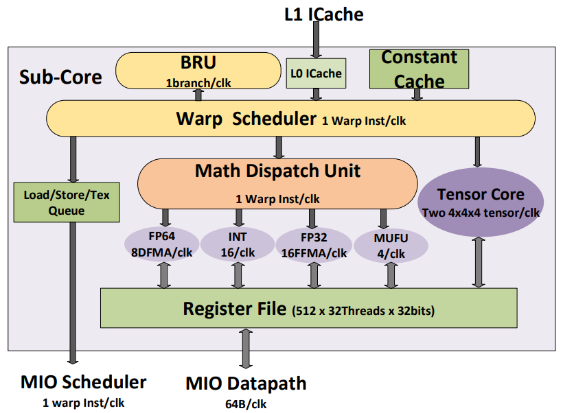  
As described by NVIDIA, multiple tensor cores are included inside each SM. The SM design in Volta is partitioned into four processing blocks which NVIDIA refers to as Sub-Cores. As shown in Figure 1, each sub-core in Volta has two tensor cores, one Warp scheduler, one dispatch unit, and a 64 KB register file.

数据划分层次：  
tile：M×N×K，warp-level，例如WMMA API支持的各种尺寸。  
fragment：each tile is further divided into “fragments” where a fragment is a set of tile elements that are mapped into the registers of a single thread.

### <font color=khaki>有关WMMA API</font>

The CUDA WMMA API provides three new functions: load_matrix_sync, store_matrix_sync and mma_sync. All three functions perform an implicit warp-wide barrier synchronization before computing a result. The load_matrix_sync and store_matrix_sync functions are used for loading and storing a portion of the input matrices in the general-purpose registers accessible to each thread. The mma_sync function performs a warp synchronous matrix multiply-accumulate operation producing an M × N (e.g., 16 × 16) result in the general-purpose registers associated with the tile for the D matrix.

### <font color=khaki>PTX指令集</font>

```cuda
/// Tensor Core PTX instructions ///
wmma.load.a.sync.layout.shape.type ra, [pa] {stride};
wmma.load.b.sync.layout.shape.type rb, [pb] {stride};
wmma.load.c.sync.layout.shape.type rc, [pc] {stride};
wmma.mma.sync.alayout.blayout.shape.dtype.ctype rd, ra, rb, rc;
wmma.store.d.sync.layout.shape.type rd, [pd] {stride};
```

The wmma.mma PTX instruction performs a warp-level
matrix-multiply with accumulate operation. This instruction
computes D = A × B + C using registers a, b and c which
contain the matrix A, B and C respectively. The computed
results are stored in general-purpose registers d in each thread.

### <font color=khaki>Tensor Core</font>

如前所述，Volta架构每个SM有4个sub-core，每个sub-core有2个tensor core。  
Volta架构的每个tensor core在每个周期可以完成1个4×4的MACC（FP16），而WMMA API的规模以tile-size呈现，比4×4大很多。  
因此，m16n16k16指令被划分成16个子矩阵，每个子矩阵都要进行4次4×4运算，所以共需要64次tensor core运算。  
tensor core有两种运算模式：  

1. FP16 mode，A、B、C均为FP16，D为FP32  
2. mixed-precision mode，A、B为FP16，C为FP32，D为FP32  

## Tensor Core的底层实现

4个thread为1个threadgroup，1个warp有32个thread，即8个threadgroup。

### <font color=khaki>矩阵元素映射</font>

*Distribution of operand matrix elements to threads for Tensor Cores in the Titan V (Volta):*  
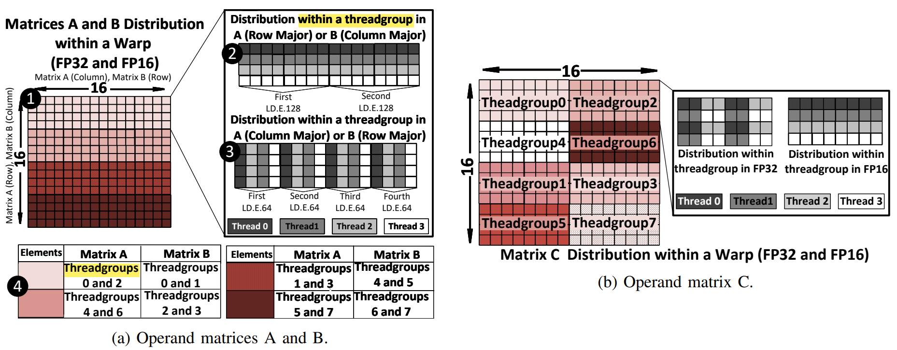  

*Distribution of operand matrix elements to threads for tensor cores in the RTX 2080 (Turing):*  
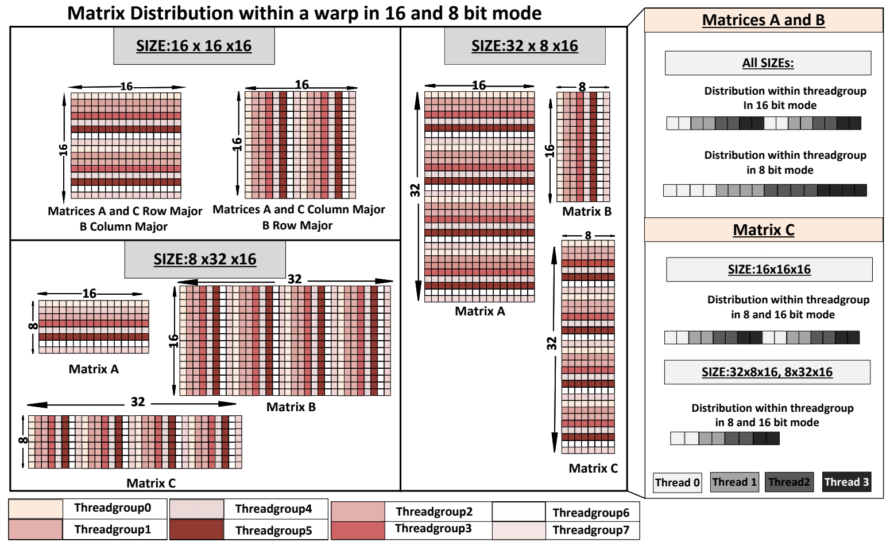  
each operand matrix element is loaded only once.  

### <font color=khaki>PTX to SASS</font>

ptx层级的wmma.load和wmma.store指令被拆分成SASS层级的数个load（LD.E.64, LD.E.128, LD.E.SYS）和store（ST.E.SYS）指令，也即一个wmma的load和store操作需要数个SASS指令来完成；同时表明，tensor core直接从GPR（general-purpose register）得到矩阵的fragments。

ptx层级的wmma.mma指令被拆分成SASS层级的数个HMMA指令，但Turing架构的4-bit mma指令被转换成单个HMMA指令。

*Volta架构 - Disassembled SASS instructions corresponding to WMMA:MMA API:*  
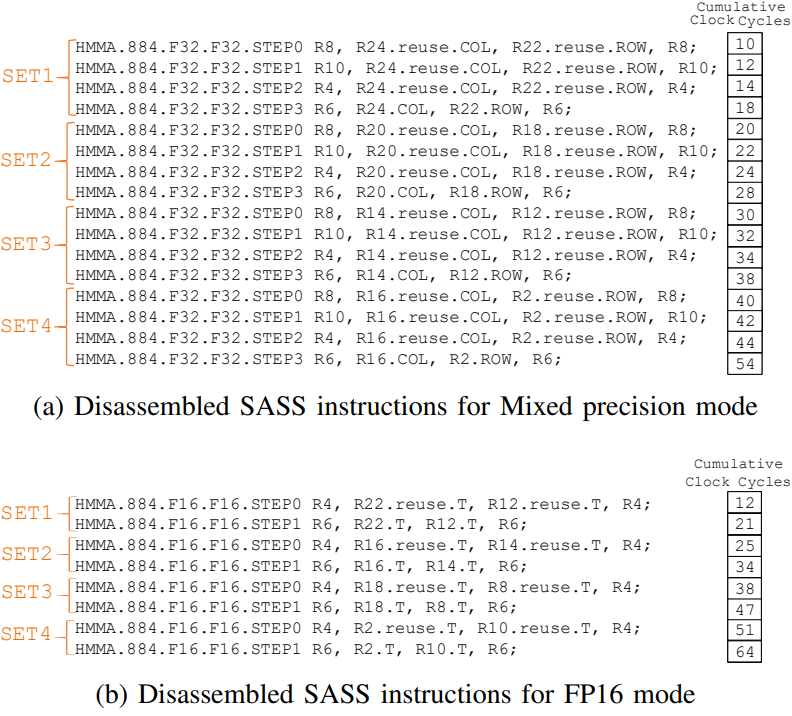  
一条wmma.mma指令在Volta架构中的SASS如上图所示。Volta架构只支持M16N16K16。分为4个SET，每个SET又分为多个step执行。

*Average cycles to execute all HMMA instructions up to SET n on Turing. “Acc” is accumulation mode:*  
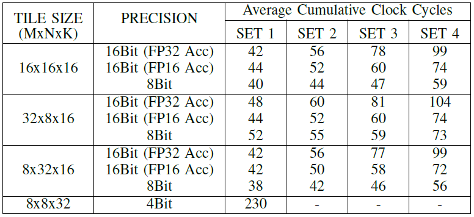  

### <font color=khaki>HMMA指令执行过程</font>

*HMMA instruction analysis for Volta (Titan V):*  
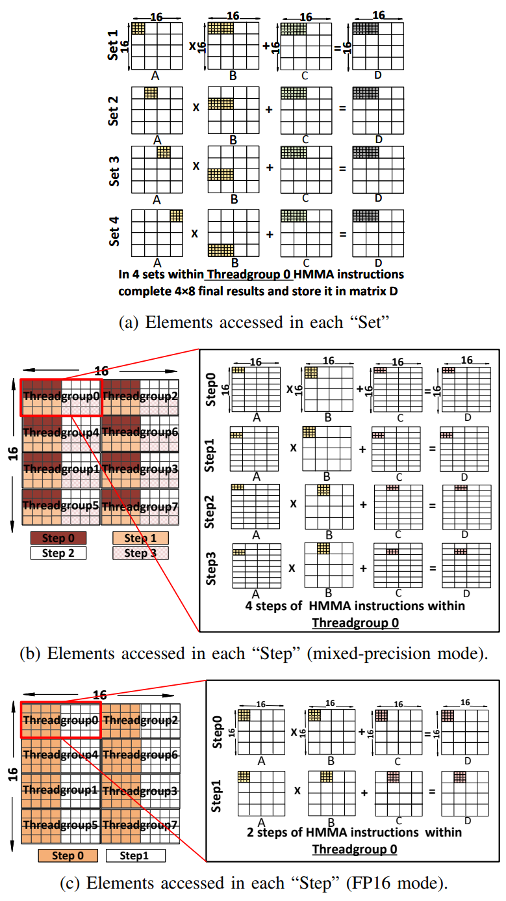  
如前文所述，每个threadgroup负责加载矩阵的1个sub-tile。在这里，每个threadgroup运算它负责的sub-tile。一条wmma.mma指令分为多个set，每个set分为多个step。  
注意，上图(a)是对于threadgroup 0的4个set的分析，所用到的矩阵A的数据的确是threadgroup 0加载的；但实际上threadgroup 0只加载了矩阵B数据的前4列，那么B的剩下4列从何而来？后文将分析到，Volta架构把2个threadgroup组成1个octet，那么B的剩下4列就来自同一个octet的另一个threadgroup。  

*HMMA instruction analysis for Turing (RTX2080):*  
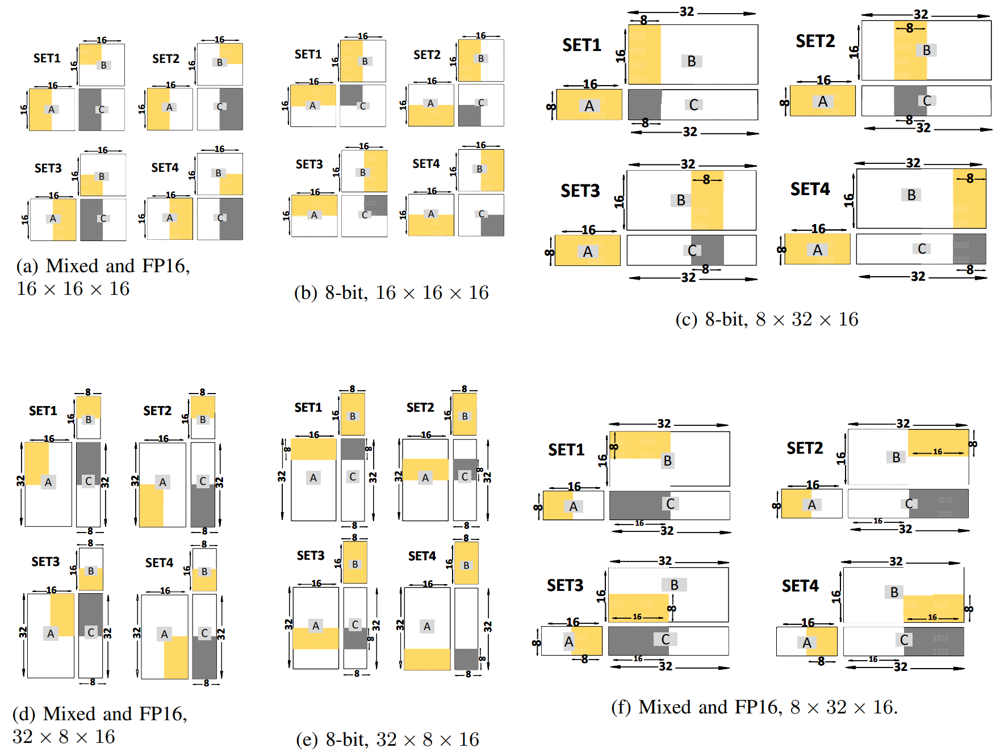  
Turing架构的SASS失去了显式指定的step文本，作者推测应当是在微架构中用状态机实现。

### <font color=khaki>将threadgroup组织成octet</font>

本节的分析基于Volta架构。前文简要提到了octet，每2个threadgroup组成1个octet，每个step指令的执行，1个octet的部分数据送入tensor core运算，每个octet都能够独立的运算（不会发生同时使用来自2个octet的数据进行运算的情况；但不是说计算结果上的独立，例如D矩阵左上角的最终值需要threadgroup0、threadgroup4的结果和threadgroup2、threadgroup6的结果加起来才能完成）。下面的图片和表格是一些详细运算步骤。  
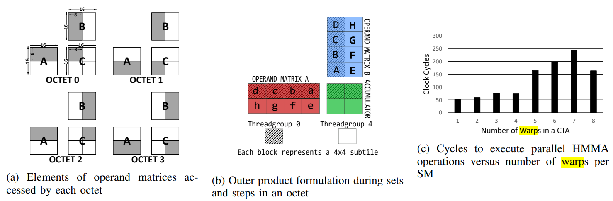  
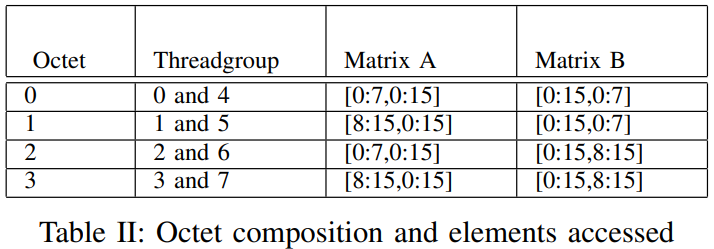  
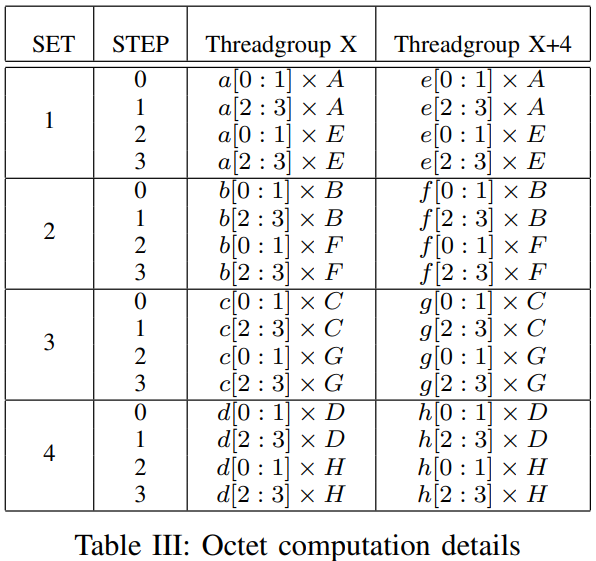  

## Tensor Core微架构

每个SM被划分成4个sub-core，每个sub-core有2个tensor core，每个tensor core每个cycle进行一次FP16的4×4矩阵乘累加，也就是16次4元素向量的点积；同时，每个threadgroup每2个cycle完成1个2×4矩阵的运算（这个数值已经考虑了每2个threadgroup组成1个octet进行运算的重复），共8个threadgroup，所以1个warp的32个thread每个cycle要完成32次4元素点积。因此，每个warp应该使用2个tensor core。  
此外，作者还从另一个角度进行了说明。当向1个SM分配1~4个warp时，tensor core的计算资源被充分利用。当向SM分配5~8个warp时，计算所需的延迟翻倍。所以合适的状态是每个warp分配到1个硬件上的sub-core中并且占用2个tensor core。

文章分析了带宽，每个thread的每条step指令耗费2个cycle，取每个操作数通过2个32bit的register pair，每条指令都取3个操作数（A、B、C），1个warp共32个thread，所以每个warp取寄存器的带宽是32bit×2个GPR×3个op×32个thread=6kb/2cycle。当模式是FP16时，每个set只有2个step，带宽被充分利用（如果不考虑数据在同一个octet的不同threadgroup之间和时间上的复用；复用的情形可以参考下方的tensor core微架构以及上方的HMMA指令中寄存器的.reuse标识）；当模式是mixed-precision时，每个set有4个step，因为取C带宽被占满，如前文的图片 *HMMA instruction analysis for Volta (Titan V)* 所示，此时取A的带宽没有被占满。

*Proposed Tensor Core Microarchitecture:*  
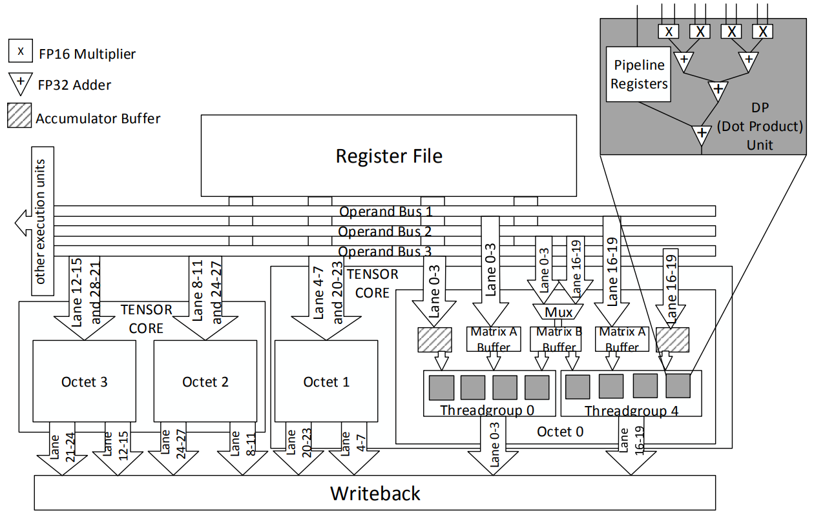  
每条lane对应1个thread，每个threadgroup有4条lane，每条lane的宽度是3*2*32bit，其中3是A、B、C3个操作数，每个操作数每条指令都是2个32bit的GPR。考虑threadgroup0，step0用2个cycle，因此分成step0.1和step0.2。分析mixed precision情况。  
step0.1时，矩阵A的lane0拿到thread0负责的矩阵A的第1行的最左边的4个FP16（带宽没有用满）；矩阵B的lane0~3拿到thread0~3负责的16个FP16，广播到threadgroup0和threadgroup4；它们在每个threadgroup中做4个4元素的向量点乘。矩阵C的lane0~1拿到thread0~1负责的4个FP32，分别在每个threadgroup的4个FEDP最后与点积结果进行求和。  
step0.2时，矩阵A的lane1拿到thread1负责的矩阵A的第2行的最左边的4个FP16（带宽没有用满）；矩阵B复用之前广播的16个FP16；它们在每个threadgroup中做4个4元素的向量点乘。矩阵C的lane2~3拿到thread2~3负责的4个FP32，分别在每个threadgroup的4个FEDP最后与点积结果进行求和。  
让我们分析一下带宽。上面的操作用了2cycle。每2个threadgroup，取A，用了2×4×16×2=256b/2cycle，其中乘式分别表示(2threadgroup，4个FP16，step0的2个子步骤)；取B，用了16×16=256b/2cycle，因为取B在2个threadgroup、2个子步骤都是复用数据的；取C，用了2×4×32×2=512b/2cycle。所以每两个threadgroup的带宽需求是1024b/2cycle。1个warp有8个threadgroup，所以带宽需求是4kb/2cycle。  
前文分析了带宽为6kb/2cycle，差别在哪里？发现得出6kb/2cycle的结论时，按照“每个thread的每条step指令耗费2个cycle，取每个操作数通过2个32bit的register pair，每条指令都取3个操作数（A、B、C）”；但实际上，取A未占满带宽、取B存在复用。  
以warp的视角来看，每个warp，每2个cycle（1个step），需要8个threadgroup的2×4的subtile的FP16的A，8个threadgroup的4×4的FP16的B（且每2个threadgroup复用相同的B），8个threadgroup的2×4的FP32的C。带宽需求是8×8×16+8×16×16/2+8×8×32=4kb/2cycle，符合前文计算的结果。所以6kb/2cycle是理论最大带宽需求。  
