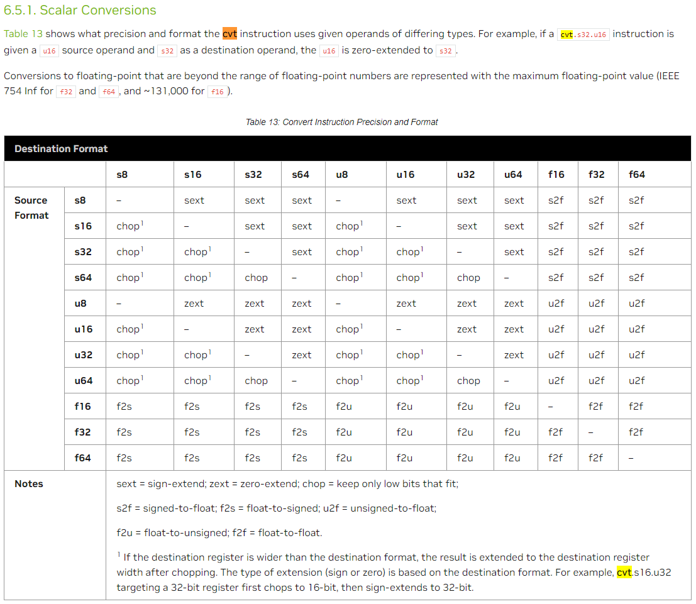

## s4/u4乘法指令列表

```ptx
mma.sync.aligned.shape.row.col{.satfinite}.s32.atype.btype.s32 d, a, b, c;

.shape   = {.m8n8k32, .m16n8k32, .m16n8k64}
.atype   = {.u4, .s4};
.btype   = {.u4, .s4};
```

上面的代码是ptx mma指令所有和4bit整数计算有关的配置选项。其中，.atype和.btype可以任意选取，例如指定.atype=.u4、同时.btype=.s4的情形是允许的。已经通过代码测试过这种情形。

## ptx中的数据格式转换

### cvt

支持的转换类型：  
  

ptx格式如下：

```ptx
cvt{.irnd}{.ftz}{.sat}.dtype.atype         d, a;  // integer rounding
cvt{.frnd}{.ftz}{.sat}.dtype.atype         d, a;  // fp rounding
cvt.frnd2{.relu}{.satfinite}.f16.f32       d, a;
cvt.frnd2{.relu}{.satfinite}.f16x2.f32     d, a, b;
cvt.frnd2{.relu}{.satfinite}.bf16.f32      d, a;
cvt.frnd2{.relu}{.satfinite}.bf16x2.f32    d, a, b;
cvt.rna{.satfinite}.tf32.f32               d, a;
cvt.frnd2{.relu}.tf32.f32                  d, a;
cvt.rn.satfinite{.relu}.f8x2type.f32       d, a, b;
cvt.rn.satfinite{.relu}.f8x2type.f16x2     d, a;
cvt.rn.{.relu}.f16x2.f8x2type              d, a;

.irnd   = { .rni, .rzi, .rmi, .rpi };
.frnd   = { .rn,  .rz,  .rm,  .rp  };
.frnd2  = { .rn,  .rz };
.dtype = .atype = { .u8,   .u16, .u32, .u64,
                    .s8,   .s16, .s32, .s64,
                    .bf16, .f16, .f32, .f64 };
.f8x2type = { .e4m3x2, .e5m2x2 };
```

例如，s32->bf16/f16/f32都可以通过上述指令实现。  

.ftz: flush-to-zero, when an operation would produce a denormal result under the usual arithmetic, a zero is returned instead.  

.sat: saturation modifier  
For integer destination types, .sat limits the result to MININT..MAXINT for the size of the operation. Note that saturation applies to both signed and unsigned integer types.  
The saturation modifier is allowed only in cases where the destination type’s value range is not a superset of the source type’s value range; i.e., the .sat modifier is illegal in cases where saturation is not possible based on the source and destination types.  
For float-to-integer conversions, the result is clamped to the destination range by default; i.e, .sat is redundant.  
For floating-point destination types, .sat limits the result to the range [0.0, 1.0]. NaN results are flushed to positive zero. Applies to .f16, .f32, and .f64 types.

.relu: For .f16, .f16x2, .bf16, .bf16x2, .e4m3x2, .e5m2x2 and .tf32 destination types, .relu clamps the result to 0 if negative. NaN results are converted to canonical NaN.

.satfinite: For .f16, .f16x2, .bf16, .bf16x2, .e4m3x2, .e5m2x2 and .tf32 destination formats, if the input value is NaN, then the result is NaN in the specified destination format. If the absolute value of input (ignoring sign) is greater than MAX_NORM of the specified destination format, then the result is sign-preserved MAX_NORM of the destination format.  

### cvt.pack

```ptx
cvt.pack.sat.convertType.abType  d, a, b;
    .convertType  = { .u16, .s16 }
    .abType       = { .s32 }

cvt.pack.sat.convertType.abType.cType  d, a, b, c;
    .convertType  = { .u2, .s2, .u4, .s4, .u8, .s8 }
    .abType       = { .s32 }
    .cType        = { .b32 }
```

按照特定的Semantics将a、b、c的部分比特存在d中。Semantics如下：

```c++
ta = a < MIN(convertType) ? MIN(convertType) : a;
ta = a > MAX(convertType) ? MAX(convertType) : a;
tb = b < MIN(convertType) ? MIN(convertType) : b;
tb = b > MAX(convertType) ? MAX(convertType) : b;

size = sizeInBits(convertType);
td = tb ;
for (i = size; i <= 2 * size - 1; i++) {
    td[i] = ta[i - size];
}

if (isU16(convertType) || isS16(convertType)) {
    d = td;
} else {
    for (i = 0; i < 2 * size; i++) {
        d[i] = td[i];
    }
    for (i = 2 * size; i <= 31; i++) {
        d[i] = c[i - 2 * size];
    }
}
```

### bfe指令——数据位提取

bit field extract，格式：

```ptx
bfe.type  d, a, b, c;

.type = { .u32, .u64,
          .s32, .s64 };
```

功能：将a数据的从b位起始、长度为c位的数据存放到d中。  
Semantics：

```c++
msb = (.type==.u32 || .type==.s32) ? 31 : 63;
pos = b & 0xff;  // pos restricted to 0..255 range
len = c & 0xff;  // len restricted to 0..255 range

if (.type==.u32 || .type==.u64 || len==0)
    sbit = 0;
else
    sbit = a[min(pos+len-1,msb)];

d = 0;
for (i=0; i<=msb; i++) {
    d[i] = (i<len && pos+i<=msb) ? a[pos+i] : sbit;
}
```

bfe指令，配合移位指令，可以将32bit寄存器中存放的8个4-bit int依次提取出来。  
当然，也可以通过普通的位掩码和位与运算来提取数据。

## cutlass s4 demo
