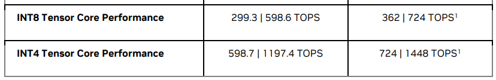

# ada架构GPU

和前代产品相似，每个SM被分为4个“processing blocks (or partitions)”，每个partition有1个“Ada Fourth-Generation Tensor Core”。  

Compared to Ampere, Ada delivers more than double the FP16, BF16, TF32, INT8, and INT4 Tensor TFLOPS, and also includes the Hopper FP8 Transformer Engine, delivering over 1.3 PetaFLOPS of tensor processing in the RTX 4090.

GeForce RTX 4090是首款基于新Ada架构的GeForce显卡。在GeForce RTX 4090的核心是AD102 GPU，它是基于NVIDIA Ada架构的最强大GPU。AD102的设计旨在为玩家和创作者提供革命性的性能，使RTX 4090能够在许多游戏中以4K分辨率持续提供超过100帧每秒的帧率。

对于数据中心，基于Ada架构的新NVIDIA L40 GPU提供了前所未有的视觉计算性能。与上一代NVIDIA A40 GPU相比，NVIDIA L40的原始FP32计算性能提高了2倍，渲染性能提高了近3倍，在相同的300W功率封套下，张量运算性能高达724 TFLOPs2。NVIDIA L40是适用于运行诸如NVIDIA Omniverse、生成式AI、自动驾驶车辆模拟、FP32高性能计算（HPC）、虚拟工作站、云游戏以及单GPU AI训练和推理等应用的理想GPU。搭载L40的NVIDIA认证系统经过优化，可以大规模提供Omniverse，如包含八个L40 GPU的参考NVIDIA OVX系统，可扩展以提供支持RTX的数字孪生渲染。新的NVIDIA L40在与上一代NVIDIA A40 GPU相同的300W TDP和物理外形下实现了令人印象深刻的性能提升。

最后，基于Ada的NVIDIA L4旨在成为数据中心中用于AI、图形和视频工作负载的最佳低功耗通用GPU。紧凑而多功能的低轮廓、单插槽、72W L4 GPU适合任何服务器，非常适合从区域数据中心到边缘，包括户外位置的全球部署。NVIDIA L4是各种应用的理想选择，例如AI驱动的视频服务、语音AI（ASR+NLP+TTS）、小型生成式AI、搜索与推荐、云游戏和虚拟工作站，等等。

## RTX 4090

  

  

## RTX 4080

  

  

## L40

  

  

## L40S

  

## L4

  

  
