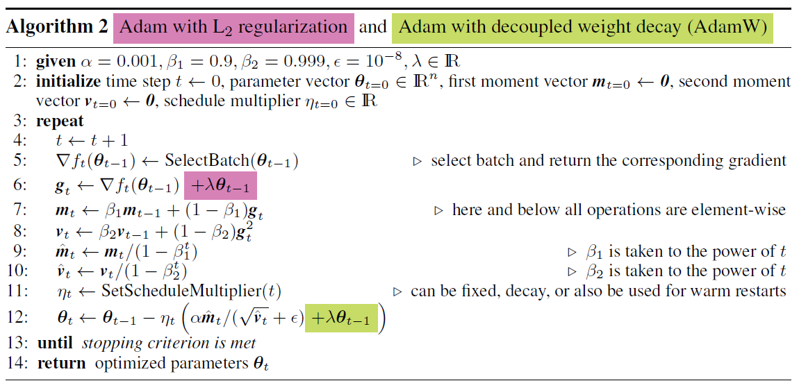
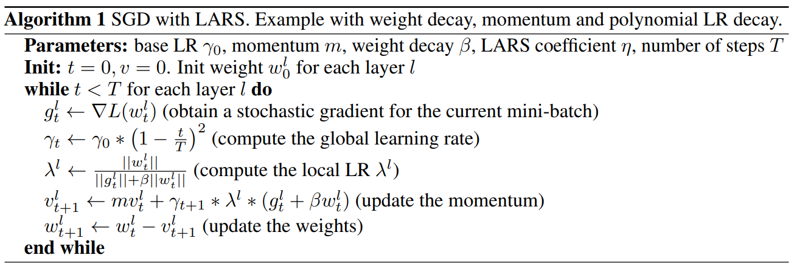
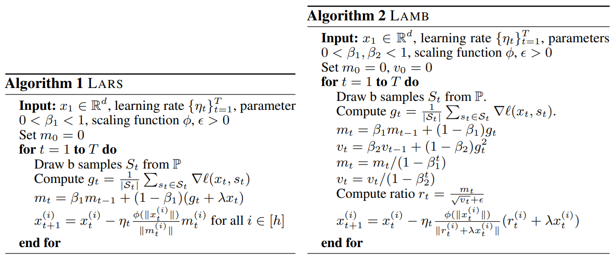
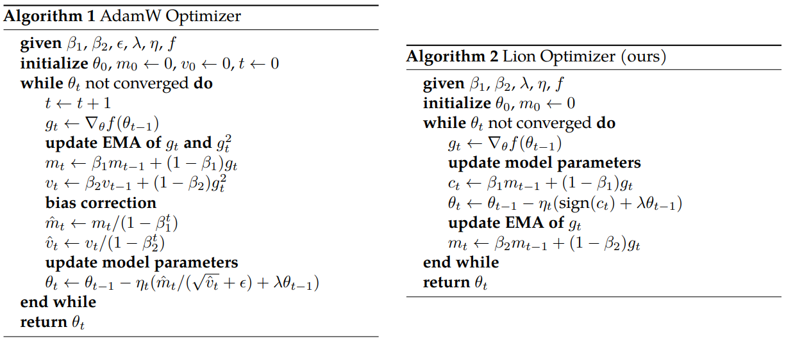
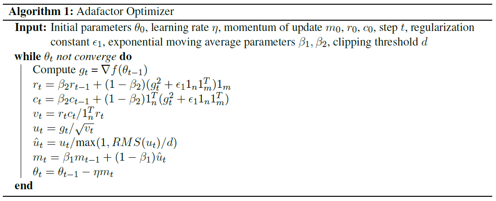
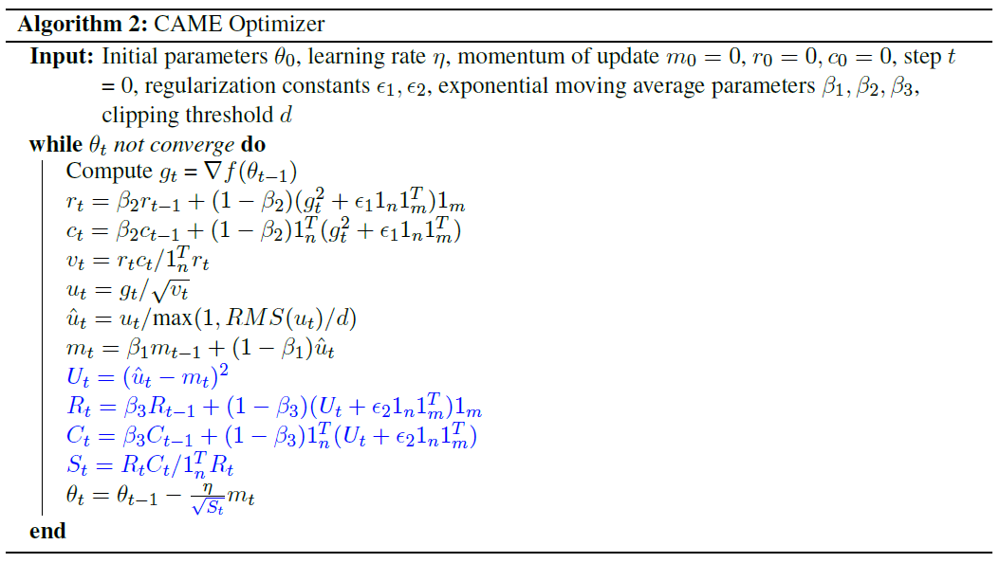

# 初步调研

## 随机梯度下降（SGD）

SGD是一种最基本的优化算法，它在每次迭代中使用单个样本（随机梯度）来更新模型参数。其主要思想是沿着梯度的反方向调整参数，使得损失函数逐渐减小。SGD算法可以用伪代码描述如下：

```python
initialize parameters randomly
for each epoch:
    for each training sample (x, y):
        compute gradient of the loss with respect to parameters: grad = compute_gradient(loss, parameters, x, y)
        update parameters: parameters = parameters - learning_rate * grad
```

## AdamW

文章[AdamW, LAMB: 大型预训练模型常用优化器](https://blog.csdn.net/weixin_43269174/article/details/106255084)简要概括了SGD、Adam、AdamW、LAMB，供参考。

[pytorch实现AdamW](https://github.com/pytorch/pytorch/blob/b7bda236d18815052378c88081f64935427d7716/torch/optim/adamw.py#L6)

本质是两点：

- momentum算法思想：用梯度的一阶矩调整参数更新的方向。参数更新时在一定程度上保留之前更新的方向，同时又利用当前batch的梯度微调最终的更新方向，简言之就是通过积累之前的动量来 (previous_sum_of_gradient) 加速当前的梯度。
- 自适应学习率：用梯度的二阶矩调整学习率。

AdamW是Adam优化器的一种变体，它添加了权重衰减项来帮助防止模型过拟合。AdamW还具有自适应学习率的特性，通过估计一阶和二阶矩来调整学习率的大小。以下是AdamW的伪代码：

```python
initialize parameters randomly
initialize first moment estimates (m) and second moment estimates (v) for each parameter to (0)
initialize time step (t) to 0
for each epoch:
    for each training sample (x, y):
        t = t + 1
        compute gradient of the loss with respect to parameters: grad = compute_gradient(loss, parameters, x, y)
        update biased first moment estimate: m = beta1 * m + (1 - beta1) * grad
        update biased second raw moment estimate: v = beta2 * v + (1 - beta2) * grad^2
        compute bias-corrected first moment estimate: m_hat = m / (1 - beta1^t)
        compute bias-corrected second moment estimate: v_hat = v / (1 - beta2^t)
        update parameters: parameters = parameters - learning_rate * m_hat / (sqrt(v_hat) + epsilon) - weight_decay * learning_rate * parameters
```

当使用Adam优化器时，需要初始化每个参数的一阶矩估计（m）和二阶矩估计（v）。这些矩估计用于计算自适应学习率以及动量。

beta1和beta2：这是一阶矩估计和二阶矩估计的指数衰减率。它们控制着对历史梯度的影响程度。

epsilon：这是一个小的常数，用于防止分母为零，以增强数值稳定性。通常设置一个很小的值，例如epsilon=1e-8。

weight_decay：这是权重衰减（L2正则化）的系数。它用于减小模型参数的大小，以防止模型过拟合。在AdamW中，权重衰减是在参数更新时进行的。通常设置为一个小的正数，例如weight_decay=0

  

## LARS

[参考讲解博客](https://www.jianshu.com/p/e430620d3acf)，[论文地址](https://arxiv.org/abs/1708.03888)

原理是根据每层网络的参数和梯度的L2范数之比，动态更新学习率。调整学习率的方法和AdamW有所不同，可以有效缓解较大batch size训练前期由于学习率太大导致的不稳定问题。

  

## LAMB

2019年4月的论文，来自Google、UC Berkeley。

结合了Adam和LARS的算法。自适应学习率采用LARS的方法，

[论文地址](https://arxiv.org/abs/1904.00962)

算法伪代码，其中LARS是作者本人之前的算法：

  

## Lion

2023年2月的论文，来自Google、UCLA。

[论文地址](https://arxiv.org/abs/2302.06675)，[代码地址](https://github.com/google/automl/blob/master/lion/lion_pytorch.py)

和AdamW算法伪代码的比较：

  

梯度只决定了更新方向，用sign函数取动量的符号为1或-1。减少了计算量。

性能上，超参数更少，训练成本更低，同时多个任务场景中训练出来的模型精度更高。一篇博客[Google Brain新提出的优化器“Lion”，效果要比Adam(W)更好](https://zhuanlan.zhihu.com/p/609462814)总结了这些。

## Adafactor

对于NLP来说，动量的重要性小于自适应学习率。Adafactor首先抛弃了动量，其次用低秩分解存储参数`v`。

## CAME

2023年8月的论文，来自NUS、华为。

作者本人写的博客[CAME优化器: 以Adafactor的内存开销达到Adam的性能](https://zhuanlan.zhihu.com/p/643816029)，精简地概括了算法、特点、效果。

came是基于Adafactor的改进。

  

  
