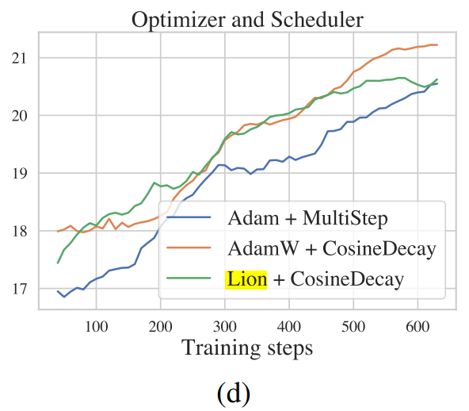
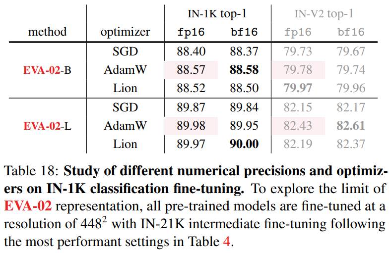

## Lion

Lion是通过空间搜索搜出来的架构。下面包含了截止2023年8月16日，Google Scholar上所有引用了Lion优化器原文的paper。

[Lens-to-Lens Bokeh Effect Transformation. NTIRE 2023 Challenge Report](https://openaccess.thecvf.com/content/CVPR2023W/NTIRE/html/Conde_Lens-to-Lens_Bokeh_Effect_Transformation._NTIRE_2023_Challenge_Report_CVPRW_2023_paper.html)

研究目标：探索一种基于扩散模型的图像恢复方法，能够在低分辨率潜在空间进行大尺寸真实图像的恢复，特别是针对镜头间波克效果转换的任务。

方法概述：基于IR-SDE [40]，一种基于随机微分方程（SDE）的扩散框架，可以自然地将高质量图像转换为其降质版本。在测试时，使用一个卷积神经网络（CNN）来估计边缘分布的分数，从而从低质量图像反向恢复高质量图像。为了处理高分辨率图像的计算难题，作者提出了在低分辨率潜在空间进行恢复的方法，通过引入一个预训练的U-Net网络来压缩和解压缩图像。

Training and Inference Description: The team initiates by training the U-Net on the BETD dataset [12, 51] for 300,000 iterations, followed by training the Reffusion model based on the U-Net for 400,000 iterations. During the U-Net training phase, all input images are cropped to 128. In the Reffusion model training phase, all input images are cropped to 512 × 512, and U-Net is employed to compress them to 128 × 128. Both models utilize the Lion [10] optimizer with an initial learning rate of 3e-5, which is subsequently decayed to 1e-7 using the Cosine scheduler. The diffusion step is set at 100. For testing, the image is first compressed into latent space and subjected to SDE for clean image recovery. Subsequently, the image is decompressed back into the HR space.

[Refusion: Enabling Large-Size Realistic Image Restoration with Latent-Space Diffusion Models](https://openaccess.thecvf.com/content/CVPR2023W/NTIRE/html/Luo_Refusion_Enabling_Large-Size_Realistic_Image_Restoration_With_Latent-Space_Diffusion_Models_CVPRW_2023_paper.html)

提出了Refusion：一种基于扩散模型的图像恢复方法，能够处理各种真实世界的图像退化问题，如阴影去除、高分辨率非均匀去雾、立体超分辨率和虚化效果转换。  
改进了扩散模型：通过探索不同的网络结构、噪声水平、去噪步数、训练图像大小和优化器/调度器选择，提高了扩散模型的性能和效率。  
提出了U-Net基于潜在空间的扩散策略：通过在低分辨率的潜在空间进行扩散，同时保留原始输入的高分辨率信息，实现了对大尺寸图像的恢复。  
在多个数据集上进行了实验：展示了Refusion在各种图像恢复任务上的有效性和通用性，并在NTIRE 2023阴影去除挑战赛中获得了最佳感知性能和第二名的总体排名。  

有关optimizer：  
As an example, simply adding a cosine decay scheduler can improve the accuracy by 0.5% for ResNet-50 on the ImageNet classification task [26]. To find out which optimizer better matches the diffusion model, we provide three comparisons including 1) Adam + multi-step decay, 2) AdamW [39] + cosine decay, 3) Lion [9] + cosine decay. The results in Figure 5d show that both AdamW and Lion perform slightly better then the Adam optimizer with multi-step learning rate decay.

  
上图中，纵坐标是用于衡量图像恢复质量的指标，叫做峰值信噪比（Peak Signal-to-Noise Ratio，简称PSNR）。它是一种常用的客观评价方法，用于比较原始图像和恢复图像之间的差异。PSNR越高，说明恢复图像越接近原始图像，恢复效果越好。一般来说，PSNR在20dB以下表示恢复效果很差，而在30dB以上表示恢复效果很好。

[On Efficient Training of Large-Scale Deep Learning Models: A Literature Review](https://arxiv.org/abs/2304.03589)

这是一篇对深度学习训练加速技术的review，发表于2023年4月，包含了对Lion和其他几个optimizer的评价。现摘录如下。

在最近的进展中，Loshchilov和Hutter [154] 提出了AdamW，它将梯度和权重衰减正则化作为动量项的组成部分。这一创新在Transformer训练中取得了显著的成功。You等人 [288] 应用了逐层正则化，即LARS，以增强单独层级上的标量准确性。由于反向传播的链式规则，梯度表现出明显的分层特性，导致由于特定层级的梯度范数和权重范数之间的不平衡而产生不稳定性。因此，该方法将权重范数纳入标量中，以进一步调整学习率，以实现更精确的调整。同样，You等人 [287] 在以Adam为基础的优化器上采用了这种技术，从而提高了性能。  
为了进一步归一化l2正则化项，引入了AdamW，旨在减轻不同层级之间参数差异的影响。这种适应性在Transformer和ViT模型的训练中表现出了显著的效果。Xie等人 [280] 引入了Adan，这是一种应用于加速原始Adam优化器的Nesterov动量的变体，以实现更快的训练。这涉及将原始梯度转化为惯性型梯度，以近似下一个状态的方向。前瞻性调整还进一步规范了梯度，使其能够在早期阶段实现有效的加速训练。更近期，陈等人 [28] 引入了Lion优化器，一种显著加速训练速度的演化标志动量方法。Lion源于在预定义的数学函数池内进行基于策略的探索。它首先探索了一组21个函数，以确定复杂版本。通过经验处理和近似，Lion最终使用带有动量的符号梯度来设计更新。这种实现可能在未来的研究领域中发挥重要作用。  
自适应优化器在训练大型模型方面取得了重大进展。许多早期的工作涉及通过Hadamard乘积采用逐元素标量的方法。这种策略在大批量大小下有效稳定了训练，并且通常比基于原始梯度的方法更快地收敛。展望未来，将阶段性和层次性考虑与冻结技术结合起来，为优化器设计提供了新的视角。

[EVA-02: A Visual Representation for Neon Genesis](https://arxiv.org/abs/2303.11331)

论文主题：本文介绍了EVA-02，一种基于Transformer的视觉表示，通过掩码图像建模（MIM）从一个强大的CLIP视觉编码器中学习语言对齐的视觉特征。  
论文贡献：EVA-02在各种视觉任务上取得了优越的性能，同时使用了更少的参数和计算资源。特别地，使用公开可用的数据，EVA-02-L（304M参数）在ImageNet-1K上达到了90.0的微调精度，超过了之前最大和最好的开源CLIP模型。  
论文方法：EVA-02采用了最新的Transformer架构设计，包括SwiGLU FFN、sub-LN、2D RoPE等，并使用MIM从EVA-CLIP中预训练。EVA-02提供了四种不同大小的模型变体，分别是EVA-02-Ti（6M）、EVA-02-S（22M）、EVA-02-B（86M）和EVA-02-L（304M）。

本文用了3个optimizer微调，有关Lion：  
In Table 18, we demonstrate that sufficiently pre-trained EVA-02 representations exhibit robustness that allows fine-tuning across different numerical precisions (e.g., fp16 and bf16) and optimizers (e.g., Lion [25], AdamW [64, 84], and SGD [87]). Notably, fine-tuning can be carried out using the SGD optimizer with only a marginal performance decrease.

  

[Cross-View Hierarchy Network for Stereo Image Super-Resolution](https://openaccess.thecvf.com/content/CVPR2023W/NTIRE/html/Zou_Cross-View_Hierarchy_Network_for_Stereo_Image_Super-Resolution_CVPRW_2023_paper.html)

论文目的：提出了一种新的方法，用于从低分辨率的立体图像对中恢复高分辨率的立体图像对，利用了不同视角之间的互补信息。  
论文方法：设计了一个简单而有效的网络结构，包括两个核心模块：交叉层次信息挖掘模块（CHIMB）和交叉视角交互模块（CVIM）。CHIMB用于从单视图中提取不同层次的特征，利用了通道注意力和大核卷积注意力机制。CVIM用于融合不同视图中的相似特征，利用了交叉视角注意力机制。  
论文结果：在四个公开数据集上进行了实验，与现有的立体图像超分辨率方法进行了比较，证明了所提方法的有效性和优越性。所提方法在保持高质量的重建结果的同时，具有更少的参数和更高的效率。

本文的训练配置：我们的网络采用了Lion方法进行优化，使用了β1=0.9，β2=0.999和批大小为8。CVHSSR是使用PyTorch开发的，并在配备有四块Nvidia RTX 3090 GPU的工作站上执行。最初，学习率设定为5 × 10^-4，并通过余弦策略进行后续衰减。该模型进行了20万次迭代的训练。为了应对潜在的过拟合问题，我们引入了随机深度[11]，分别为CVHSSR-S和CVHSSR-B应用了0.1和0.2的概率。此外，我们还整合了Test-time Local Converter（TLC）[3]以进一步增强模型性能。TLC的主要目标是通过在推理期间将全局操作转换为局部操作，从而减少训练和推理期间全局信息分布之间的差异。

[Surveillance Face Presentation Attack Detection Challenge](https://openaccess.thecvf.com/content/CVPR2023W/FAS/html/Escalera_Surveillance_Face_Presentation_Attack_Detection_Challenge_CVPRW_2023_paper.html)

一个基于监控场景的人脸呈现攻击检测的竞赛，其中一个队伍horsego使用了一种名为EfficientFormerV2的神经网络作为他们的解决方案的主干网络，并使用了Lion优化器。

[Pyramid Ensemble Structure for High Resolution Image Shadow Removal](https://openaccess.thecvf.com/content/CVPR2023W/NTIRE/html/Cui_Pyramid_Ensemble_Structure_for_High_Resolution_Image_Shadow_Removal_CVPRW_2023_paper.html)

研究目的：论文提出了一种新的方法，称为Pyramid Ensemble Structure (PES)，来解决高分辨率图像去阴影的挑战性问题。该方法利用多尺度输入，金字塔阶段训练和模型集成等技术，提高了去阴影的精度和效率。

We selected NAFNet as our fundamental network architecture [4] owing to its exclusive utilization of nonlinear activation functions. We precisely trained our model employing two iterations of NAFNet: NAFNet32 and NAFNet64. Through our experimentation, we ascertained that NAFNet32 yielded the most favorable outcomes, prompting its predominant use across our results. For training the model, we opted for the Lion [2] optimizer due to its superior performance in comparison to Adam [16].

[Sophia: A Scalable Stochastic Second-order Optimizer for Language Model Pre-training](https://arxiv.org/abs/2305.14342)

2023年5月的论文，提出了新的优化器Sophia，和Lion进行比较，2 times faster。

[No Train No Gain: Revisiting Efficient Training Algorithms For Transformer-based Language Models](https://arxiv.org/abs/2307.06440)

论文目的：本文旨在评估一些提高语言模型预训练效率的算法，包括动态架构、批量选择和高效优化器。  
论文方法：本文提出了一个简单的评估协议，使用参考系统时间（RST）作为计算时间的标准，比较不同算法在固定计算预算下的训练损失、验证损失和下游任务性能。本文使用BERT和T5两种流行的Transformer语言模型，以及C4、Wikipedia和BookCorpus、MiniPile等不同的预训练数据集。  
其中，Lion和Sophia被作为高效优化器的范例进行评估。

[Bandpass Filter Based Dual-Stream Network for Face Anti-Spoofing](https://openaccess.thecvf.com/content/CVPR2023W/FAS/html/Lu_Bandpass_Filter_Based_Dual-Stream_Network_for_Face_Anti-Spoofing_CVPRW_2023_paper.html)

问题背景：人脸防欺诈技术是保护人脸识别系统安全的关键技术，目前的方法主要针对近距离场景，而远距离监控场景下的人脸图像质量低，受到遮挡、模糊等干扰，导致算法性能下降。  
方法创新：论文提出了一种基于高斯带通滤波和交叉注意力融合模块的双流网络结构，分别从原始图像和滤波后的图像中提取互补的特征，然后通过交叉注意力融合模块进行特征融合，提高了对低质量图像的泛化能力。  
实验结果：论文在第四届CVPR人脸防欺诈挑战赛上取得了6.22%的ACER指标，排名第三。论文使用了EfficientFormerV2-S2作为双流网络的骨干网络，模型参数只有25M，计算代价只有5G FLOPs。

论文中使用了Lion优化器来训练神经网络。设置了初始学习率为1e-4，最小学习率为1e-6，并使用了余弦学习率调度和5个epoch的预热期。

[Toward Understanding Why Adam Converges Faster Than SGD for Transformers](https://arxiv.org/abs/2306.00204)

论文主题：这篇论文探讨了一类基于Adam的自适应优化算法在非凸优化问题上为什么比随机梯度下降（SGD）算法收敛更快的原因，并提出了一个新的概念方向锐度（directional sharpness）来衡量优化算法在局部几何中的表现。  
方向锐度：方向锐度是指在一个给定的方向上，目标函数沿着该方向的曲率。方向锐度越低，意味着可以使用更大的步长来更新参数，并且可能得到更好的局部损失降低。方向锐度越高，意味着必须使用更小的步长来避免损失增加。作者认为，方向锐度比梯度相关性（gradient correlation）更能反映优化算法的性能。  
实验发现：作者通过实验发现，自适应算法通常具有比SGD更低的方向锐度，特别是在训练变换器（transformer）模型时。作者观察到，SGD的高方向锐度主要是由于梯度在不同坐标上的分布不均衡，导致一小部分坐标占据了大部分的梯度范数和曲率。作者提出了一种简单有效的技术，即坐标剪裁（coordinate-wise clipping），来改善优化算法的方向锐度和收敛速度。坐标剪裁的思想是根据梯度的绝对值大小，对梯度进行截断，从而防止一些坐标对更新方向和方向锐度产生过大的影响。

文中，Lion作为Adam类优化器的一种，取得了不错的表现。

[Large Language Model Distillation Doesn't Need a Teacher](https://arxiv.org/abs/2305.14864)

论文动机：本文指出，现有的语言模型蒸馏方法主要针对BERT式的编码器模型，且假设有下游任务数据可用。然而，现代LLM通常是十分庞大的解码器模型，且不便于进行任务特定的微调，而是通过零样本或少样本提示进行评估。因此，本文提倡在零样本评估的背景下进行任务无关的蒸馏，并提出了一种更实用和高效的蒸馏方法。  

论文方法：本文提出了一种无需教师模型的任务无关的零样本评估的蒸馏方法，其步骤如下：

- 从较大的模型中删除一些层，得到一个较小的模型。  
- 使用语言建模目标继续预训练这个较小的模型，使其恢复被删除层的性能。  
- 使用零样本提示在13个不同的下游任务上评估这个较小的模型。  

在训练基础模型时，Lion optimizer被用于两个基础模型，一个是300M参数的模型，另一个是1.1B参数的模型。这两个模型都使用了PaLM transformer架构，并在C4数据集上进行了预训练。  
在进行截断初始化和继续预训练时，Lion optimizer被用于从基础模型中删除一些层的过程。这个过程中，学习率被设置为基础模型预训练时的1/10，并使用了余弦衰减策略。

[White-Box Transformers via Sparse Rate Reduction](https://arxiv.org/abs/2306.01129)

白盒变换器：本文提出了一种基于稀疏率降低目标的白盒变换器架构，称为CRATE（Coding RAte TransformEr）。CRATE通过将数据分布转换为低维子空间的混合模型，实现了数据的压缩和稀疏化。  
自注意力和稀疏编码：本文从不同的角度推导出自注意力层和多层感知器层，将它们解释为对数据分布进行降噪、压缩和稀疏编码的操作。本文还提出了一种新的自注意力操作，称为子空间自注意力（SSA），它利用数据的子空间结构来增强表示能力。  
实验结果：本文在ImageNet-1K等数据集上评估了CRATE的性能，发现它可以达到与ViT相当或更好的结果，同时保持了白盒的可解释性。本文还展示了CRATE的中间表示具有良好的压缩和稀疏性质，以及与数据分布的几何关系。

使用Lion优化器[71]对CRATE和ViT模型进行预训练。我们将学习率配置为2.4 × 10^-4，权重衰减为0.5，批大小为2,048。我们采用渐进增加的线性预热策略，持续5个时期，然后使用余弦衰减策略将模型训练150个时期。实验结果表明，CRATE模型可以在ImageNet-1K上达到与ViT相近的性能，同时具有更好的可解释性和稳定性。

[Laughing Matters: Introducing Laughing-Face Generation using Diffusion Models](https://arxiv.org/abs/2305.08854)

论文主题：本文提出了一种新颖的模型，能够根据一张静态图像和一个音频片段生成逼真的笑脸视频。该模型利用了最新的扩散模型技术，能够准确地捕捉复杂的笑声动态，实现与音频输入的同步。  
论文方法：本文采用了一个基于因子化时空U-Net的架构，将噪声视频、参考帧和笑声音频作为输入，输出去噪后的图像序列。本文使用了一个专门为笑声设计的音频编码器，并应用了一些训练改进技术，如增广正则化和无分类器引导，来提高模型的泛化能力。  
论文结果：本文在四个笑声数据集上对模型进行了评估，并与其他基于语音驱动的面部动画方法进行了比较。结果表明，本文的方法在生成质量和笑声准确性方面均优于其他方法，并获得了更高的用户偏好评分。本文还通过消除头部旋转和光流分析等实验，验证了模型生成笑声视频的自然性和多样性。  

本文使用了Lion optimizer [51]来训练所有的模型，它的参数是β1 = 0.95，β2 = 0.98，学习率是6 × 10−5。1  
本文发现Lion optimizer比常用的优化器如Adam [52]或AdamW [53]收敛更快，而且最终的性能也更好或相当。2  
本文在前20个epoch中线性地增加学习率，然后在训练结束前使用余弦衰减策略。  
本文训练了200个epoch，每个minibatch有32个样本。  
本文计划在发表后公开训练和推理的代码。  

[Convergence Guarantees for Stochastic Subgradient Methods in Nonsmooth Nonconvex Optimization](https://arxiv.org/abs/2307.10053)

本文研究了随机次梯度法在非光滑非凸优化问题中的收敛性，提出了一个统一的框架，将多种SGD变体归纳为一个微分包含问题。  
本文利用保守场的概念，描述了非光滑神经网络的微分方式，证明了在单时间尺度和双时间尺度的步长下，SGD变体都能收敛到目标函数的保守场稳定点。  
本文还讨论了有限和形式的目标函数的情况，证明了SGD变体能够找到目标函数的克拉克稳定点。  
本文提到的引文[15]是一篇利用程序搜索技术自动发现优化算法的文章，其中提出了一种简单有效的SGD变体，称为Lion。本文将Lion纳入了自己的框架，并分析了其收敛性。  

[Fast light-field 3D microscopy with out-of-distribution detection and adaptation through Conditional Normalizing Flows](https://arxiv.org/abs/2306.06408)

本文提出了一种基于条件波形流（CWF）的方法，用于从单个快照的光场图像重建活体荧光斑马鱼的三维结构和神经活动。  
CWF是一种可逆神经网络，可以通过一系列可逆和可微函数将任意分布转换为正态分布，并计算精确的似然函数，用于评估重建质量和检测域偏移。  
CWF使用多尺度分层方法，利用哈尔变换进行上/下采样，并使用光场图像和三维先验作为条件信息，提高重建效率和准确性。  
本文在XLFM采集的斑马鱼数据上进行了实验，表明CWF可以快速（8Hz）且高质量（PSNR 51.48dB）地重建三维体积，并能够检测并适应不同的样本类型。  
本文使用Lion优化器[31]来训练CWF，该优化器是一种基于梯度的方法，可以有效地优化非凸目标函数，并具有自适应学习率和权重衰减等特性。Lion优化器在每个CWF的训练中被单独使用，以最小化负对数似然函数。

[Pre-trained transformer for adversarial purification](https://arxiv.org/abs/2306.01762)

本文提出了一种新的场景，RaPiD，用于快速防御部署为服务的模型遭受的对抗攻击。1在RaPiD中，只有少量的干净数据和对抗样本可用，而原始服务模型是固定的。  
本文利用预训练变换器的泛化和通用计算能力，提出了一种新的防御方法，CeTaD，将预训练变换器视为防御者。CeTaD是一个插件式的防御者，它通过一个嵌入层、一个变换器编码器和一个解码器来调整输入样本，并在输入样本上添加残差连接。  
本文在不同的数据集、不同的攻击方法和不同的目标模型上评估了CeTaD的效果，并探讨了CeTaD的优化过程、初始化策略、固定参数、结构、训练数据条件和零样本泛化能力。  
本文使用Lion优化器来优化CeTaD中的层归一化参数，而其他参数则完全冻结。Lion优化器是一种基于符号发现的自适应优化算法，它可以根据损失函数和梯度动态地生成优化算法。

[Optimizing Neural Networks through Activation Function Discovery and Automatic Weight Initialization](https://arxiv.org/abs/2304.03374)

是一篇对AutoML领域进行介绍的长篇lecture。其中提到了类似Lion这种通过自动化设计得到的成果是值得进行未来研究的领域。

[SNR-Independent Joint Source-Channel Coding for wireless image transmission](https://arxiv.org/abs/2306.15183)

论文主题：本文提出了一种基于深度学习的联合信源信道编码（JSCC）方法，称为SNR独立的JSCC（SIJSCC），它可以在不依赖信噪比（SNR）信息的情况下，实现图像在动态无线信道中的传输。  
论文创新：本文设计了一种新颖的网络结构，包括反向残差注意力瓶颈（IRAB）模块和卷积和自注意力混合（ACmix）模块，它们可以有效地提取和重建图像特征，同时减少参数和计算量。本文还通过实验验证了SIJSCC的表现优于现有的基于SNR信息的DL-JSCC方法，并且不受信道失配的影响。  
论文方法：本文采用自编码器（AE）框架，将图像编码为复数信号，然后通过未知的AWGN信道传输，最后由解码器恢复图像。本文使用L1 Charbonnier损失函数作为失真函数，并使用Lion优化器进行训练。本文使用PSNR和SSIM作为评价指标，使用ImageNet作为训练集，使用Kodak24等多个数据集作为测试集。  
论文结论：本文证明了SIJSCC可以在不需要SNR估计和反馈的情况下，自适应地学习信道特征和编解码策略，从而达到最小失真。本文还分析了SIJSCC的表达能力和有效模型复杂度之间的关系，并展示了SIJSCC在不同领域数据上的鲁棒性和适应性。  

[Cramer Type Distances for Learning Gaussian Mixture Models by Gradient Descent](https://arxiv.org/abs/2307.06753)

这篇实在没看懂，文中提到了使用Lion optimizer。附上AI生成的对摘要的解读：  
这篇论文的背景知识涉及到高斯混合模型（简称GMMs）的学习，在机器学习中扮演着重要角色。高斯混合模型以其表达能力和可解释性而闻名，广泛应用于多个领域，包括统计学、计算机视觉和分布式强化学习。然而，至今为止，很少有已知的算法可以拟合或学习这些模型，其中包括期望最大化算法和切片Wasserstein距离等。与之相对，适用于神经网络的常见学习过程，即梯度下降，能够与这些模型契合的算法则更少。  
在这篇论文中，作者推导出了在单变量一维情况下的两个高斯混合模型的闭合表达式，随后提出了一种名为“切片Cramér 2距离”的距离函数，用于学习一般的多元高斯混合模型。与之前的方法相比，我们的方法具有几个优势。首先，它在单变量情况下具有闭合形式的表达式，使用常见的机器学习库（例如PyTorch和TensorFlow）可以轻松计算和实现。其次，它与梯度下降兼容，这使得我们能够无缝地将GMMs与神经网络集成。第三，它不仅可以将GMM拟合到一组数据点上，还可以直接拟合到另一个GMM上，无需从目标模型中进行采样。第四，它具有一些理论保证，如全局梯度有界性和无偏采样梯度。这些特性在分布式强化学习和Deep Q网络方面特别有用，其中目标是学习未来奖励的分布。此外，作者还将构建一个高斯混合分布Deep Q网络作为示例来展示其效果。与以前的模型相比，该模型在表示分布方面参数效率更高，并且具有更好的可解释性。

[Potential to Enhance Large Scale Molecular Assessments of Skin Photoaging through Virtual Inference of Spatial Transcriptomics from Routine Staining](https://www.biorxiv.org/content/10.1101/2023.07.30.551188v1.abstract)

一篇生物学论文。本文介绍了一种利用深度学习方法从常规组织染色中推断空间转录组信息的方法，以研究皮肤光老化的分子变化。  
作者使用了SWIN-T视觉变换器模型，这是一种分层变换器，通过在更深层次合并相邻图像块的信息来构建分层特征图。  
作者修改了SWIN-T模型的输出层，使其包含两个前馈层，用于预测二值化或连续的基因表达。  
作者使用Lion optimizer来优化模型的参数，这是一种基于符号发现的优化算法，可以自动发现适合特定任务和数据集的优化算法。

[Steel Surface Roughness Parameter Calculations Using Lasers and Machine Learning Models](https://arxiv.org/abs/2307.03723)
这篇论文探讨了如何利用机器学习模型提高在线钢板制造过程中激光反射测量的准确性和效率。作者使用了Lion优化器来训练所有的深度学习模型，包括一维和二维的卷积神经网络、残差网络、时序卷积网络、InceptionTime、XceptionTime、MRNN-FCN、MGRU-FCN、MLSTM-FCN、ConvNeXt、ViT和Swin v2等。  
权重衰减为0.01，采用均方误差（MSE）损失函数，初始学习率设定为0.0001，并使用a learning rate scheduler based on the reduce-on-plateau strategy。

## 写在最后

> 使用New Bing辅助阅读文献，对话方式如下。  
> 请生成当前页面论文的摘要.
> 当前页面论文在什么结构的网络和步骤中使用了Lion optimizer？
