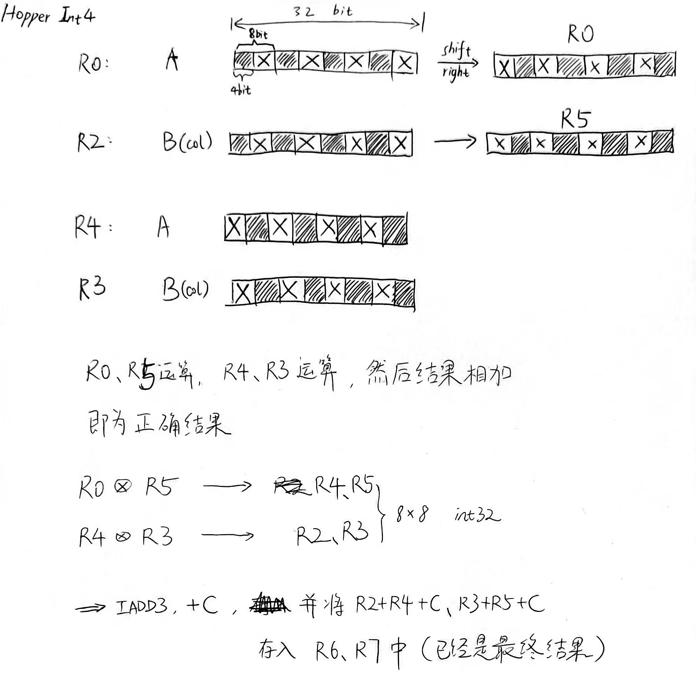

## hopper如何计算4-bit int矩阵乘？

hopper文档中取消了tensor core的4-bit整数支持，我们探究一下它怎么算4-bit整数。

代码在8_asmimma的simplekernelhopper和asmkernelhopper。

分析了simplekernelhopper.sass.txt，其中包含了sass指令，以及分析注释。

计算过程大致如下。

  
