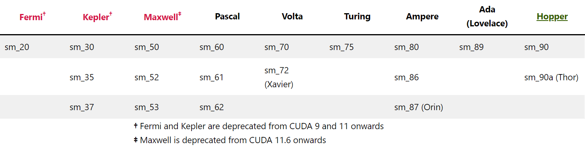

- [ptx指令在不同arch版本下的支持情况总结](#ptx指令在不同arch版本下的支持情况总结)
  - [wmma系列](#wmma系列)
    - [wmma.load](#wmmaload)
    - [wmma.store](#wmmastore)
    - [wmma.mma](#wmmamma)
  - [mma系列](#mma系列)
    - [mma.sync](#mmasync)
    - [ldmatrix](#ldmatrix)
    - [stmatrix](#stmatrix)
- [实际验证](#实际验证)

## ptx指令在不同arch版本下的支持情况总结

以tensor core指令为例。在这之前先熟悉一下[不同架构对应的CUDA gencode版本](https://arnon.dk/matching-sm-architectures-arch-and-gencode-for-various-nvidia-cards/)：



### wmma系列

#### wmma.load

**Syntax**

Floating point format .f16 loads:

```ptx
wmma.load.a.sync.aligned.layout.shape{.ss}.atype r, [p] {, stride};
wmma.load.b.sync.aligned.layout.shape{.ss}.btype r, [p] {, stride};
wmma.load.c.sync.aligned.layout.shape{.ss}.ctype r, [p] {, stride};

.layout = {.row, .col};
.shape  = {.m16n16k16, .m8n32k16, .m32n8k16};
.ss     = {.global, .shared{::cta}};
.atype  = {.f16, .s8, .u8};
.btype  = {.f16, .s8, .u8};
.ctype  = {.f16, .f32, .s32};
```

Alternate floating point format .bf16 loads:

```ptx
wmma.load.a.sync.aligned.layout.shape{.ss}.atype r, [p] {, stride}
wmma.load.b.sync.aligned.layout.shape{.ss}.btype r, [p] {, stride}
wmma.load.c.sync.aligned.layout.shape{.ss}.ctype r, [p] {, stride}
.layout = {.row, .col};
.shape  = {.m16n16k16, .m8n32k16, .m32n8k16};
.ss     = {.global, .shared{::cta}};
.atype  = {.bf16 };
.btype  = {.bf16 };
.ctype  = {.f32 };
```

Alternate floating point format .tf32 loads:

```ptx
wmma.load.a.sync.aligned.layout.shape{.ss}.atype r, [p] {, stride}
wmma.load.b.sync.aligned.layout.shape{.ss}.btype r, [p] {, stride}
wmma.load.c.sync.aligned.layout.shape{.ss}.ctype r, [p] {, stride}
.layout = {.row, .col};
.shape  = {.m16n16k8 };
.ss     = {.global, .shared{::cta}};
.atype  = {.tf32 };
.btype  = {.tf32 };
.ctype  = {.f32 };
```

Double precision Floating point .f64 loads:

```ptx
wmma.load.a.sync.aligned.layout.shape{.ss}.atype r, [p] {, stride}
wmma.load.b.sync.aligned.layout.shape{.ss}.btype r, [p] {, stride}
wmma.load.c.sync.aligned.layout.shape{.ss}.ctype r, [p] {, stride}
.layout = {.row, .col};
.shape  = {.m8n8k4 };
.ss     = {.global, .shared{::cta}};
.atype  = {.f64 };
.btype  = {.f64 };
.ctype  = {.f64 };
```

Sub-byte loads:

```ptx
wmma.load.a.sync.aligned.row.shape{.ss}.atype r, [p] {, stride}
wmma.load.b.sync.aligned.col.shape{.ss}.btype r, [p] {, stride}
wmma.load.c.sync.aligned.layout.shape{.ss}.ctype r, [p] {, stride}
.layout = {.row, .col};
.shape  = {.m8n8k32};
.ss     = {.global, .shared{::cta}};
.atype  = {.s4, .u4};
.btype  = {.s4, .u4};
.ctype  = {.s32};
```

Single-bit loads:

```ptx
wmma.load.a.sync.aligned.row.shape{.ss}.atype r, [p] {, stride}
wmma.load.b.sync.aligned.col.shape{.ss}.btype r, [p] {, stride}
wmma.load.c.sync.aligned.layout.shape{.ss}.ctype r, [p] {, stride}
.layout = {.row, .col};
.shape  = {.m8n8k128};
.ss     = {.global, .shared{::cta}};
.atype  = {.b1};
.btype  = {.b1};
.ctype  = {.s32};
```

**PTX ISA Notes**

Introduced in PTX ISA version 6.0.  
.m8n32k16 and .m32n8k16 introduced in PTX ISA version 6.1.  
Integer, sub-byte integer and single-bit wmma introduced in PTX ISA version 6.3.  
.m8n8k4 and .m16n16k8 on wmma introduced in PTX ISA version 7.0.  
Double precision and alternate floating point precision wmma introduced in PTX ISA version 7.0.  
Modifier .aligned is required from PTX ISA version 6.3 onwards, and considered implicit in PTX ISA versions less than 6.3.  
Support for ::cta sub-qualifier introduced in PTX ISA version 7.8.

**Preview Feature:**
Sub-byte wmma and single-bit wmma are preview features in PTX ISA version 6.3. All details are subject to change with no guarantees of backward compatibility on future PTX ISA versions or SM architectures.

**Target ISA Notes**

Floating point wmma requires sm_70 or higher.  
Integer wmma requires sm_72 or higher.  
Sub-byte and single-bit wmma requires sm_75 or higher.  
Double precision and alternate floating point precision wmma requires sm_80 or higher.

#### wmma.store

**Syntax**

```ptx
wmma.store.d.sync.aligned.layout.shape{.ss}.type [p], r {, stride};

.layout = {.row, .col};
.shape  = {.m16n16k16, .m8n32k16, .m32n8k16};
.ss     = {.global, .shared{::cta}};
.type   = {.f16, .f32, .s32};

wmma.store.d.sync.aligned.layout.shape{.ss}.type [p], r {, stride}
.layout = {.row, .col};
.shape  = {.m8n8k32, .m8n8k128};
.ss     = {.global, .shared{::cta}};
.type   = {.s32};

wmma.store.d.sync.aligned.layout.shape{.ss}.type [p], r {, stride}
.layout = {.row, .col};
.shape  = {.m16n16k8};
.ss     = {.global, .shared{::cta}};
.type   = {.f32};

wmma.store.d.sync.aligned.layout.shape{.ss}.type [p], r {, stride}
.layout = {.row, .col};
.shape  = {.m8n8k4 };
.ss     = {.global, .shared{::cta}};
.type   = {.f64};
```

**PTX ISA Notes**

Introduced in PTX ISA version 6.0.  
.m8n32k16 and .m32n8k16 introduced in PTX ISA version 6.1.  
Integer, sub-byte integer and single-bit wmma introduced in PTX ISA version 6.3.  
.m16n16k8 introduced in PTX ISA version 7.0.  
Double precision wmma introduced in PTX ISA version 7.0.  
Modifier .aligned is required from PTX ISA version 6.3 onwards, and considered implicit in PTX ISA versions less than 6.3.  
Support for ::cta sub-qualifier introduced in PTX ISA version 7.8.

**Preview Feature:**
Sub-byte wmma and single-bit wmma are preview features in PTX ISA version 6.3. All details are subject to change with no guarantees of backward compatibility on future PTX ISA versions or SM architectures.

**Target ISA Notes**

Floating point wmma requires sm_70 or higher.  
Integer wmma requires sm_72 or higher.  
Sub-byte and single-bit wmma requires sm_75 or higher.  
Double precision wmma and shape .m16n16k8 requires sm_80 or higher.

#### wmma.mma

```ptx
// Floating point (.f16 multiplicands) wmma.mma
wmma.mma.sync.aligned.alayout.blayout.shape.dtype.ctype d, a, b, c;

// Integer (.u8/.s8 multiplicands) wmma.mma
wmma.mma.sync.aligned.alayout.blayout.shape.s32.atype.btype.s32{.satfinite} d, a, b, c;

.alayout = {.row, .col};
.blayout = {.row, .col};
.shape  =  {.m16n16k16, .m8n32k16, .m32n8k16};
.dtype   = {.f16, .f32};
.atype   = {.s8, .u8};
.btype   = {.s8, .u8};
.ctype   = {.f16, .f32};
```

Floating point format .bf16wmma.mma:

```ptx
wmma.mma.sync.aligned.alayout.blayout.shape.f32.atype.btype.f32 d, a, b, c;
.alayout = {.row, .col};
.blayout = {.row, .col};
.shape   = {.m16n16k16, .m8n32k16, .m32n8k16};
.atype   = {.bf16 };
.btype   = {.bf16};
```

Floating point format .tf32wmma.mma:

```ptxwmma.mma.sync.aligned.alayout.blayout.shape.f32.atype.btype.f32 d, a, b, c;
.alayout = {.row, .col};
.blayout = {.row, .col};
.shape   = {.m16n16k8 };
.atype   = {.tf32 };
.btype   = {.tf32};
```

Floating point Double precision wmma.mma:

```ptx
wmma.mma.sync.aligned.alayout.blayout.shape{.rnd}.f64.f64.f64.f64 d, a, b, c;
.alayout = {.row, .col};
.blayout = {.row, .col};
.shape   = {.m8n8k4 };
.rnd = { .rn, .rz, .rm, .rp };
```

Sub-byte (.u4/.s4 multiplicands) wmma.mma:

```ptx
wmma.mma.sync.aligned.row.col.shape.s32.atype.btype.s32{.satfinite} d, a, b, c;
.shape  = {.m8n8k32};
.atype  = {.s4, .u4};
.btype  = {.s4, .u4};
```

Single-bit (.b1 multiplicands) wmma.mma:

```ptx
wmma.mma.op.popc.sync.aligned.row.col.shape.s32.atype.btype.s32 d, a, b, c;
.shape  = {.m8n8k128};
.atype  = {.b1};
.btype  = {.b1};
.op     = {.xor, .and}
```

**PTX ISA Notes**

Introduced in PTX ISA version 6.0.  
.m8n32k16 and .m32n8k16 introduced in PTX ISA version 6.1.  
Integer, sub-byte integer and single-bit wmma introduced in PTX ISA version 6.3.  
Double precision and alternate floating point precision wmma introduced in PTX ISA version 7.0.  
Support for .and operation in single-bit wmma introduced in PTX ISA version 7.1.  
Modifier .aligned is required from PTX ISA version 6.3 onwards, and considered implicit in PTX ISA versions less than 6.3.  
Support for .satfinite on floating point wmma.mma is deprecated in PTX ISA version 6.4 and is removed from PTX ISA version 6.5.

**Preview Feature:**
Sub-byte wmma and single-bit wmma are preview features in PTX ISA. All details are subject to change with no guarantees of backward compatibility on future PTX ISA versions or SM architectures.

**Target ISA Notes**

Floating point wmma requires sm_70 or higher.  
Integer wmma requires sm_72 or higher.  
Sub-byte and single-bit wmma requires sm_75 or higher.  
Double precision, alternate floating point precision wmma require sm_80 or higher.  
.and operation in single-bit wmma requires sm_80 or higher.

### mma系列

#### mma.sync

**Syntax**

Half precision floating point type:

```ptx
mma.sync.aligned.m8n8k4.alayout.blayout.dtype.f16.f16.ctype  d, a, b, c;
mma.sync.aligned.m16n8k8.row.col.dtype.f16.f16.ctype  d, a, b, c;
mma.sync.aligned.m16n8k16.row.col.dtype.f16.f16.ctype d, a, b, c;

.alayout = {.row, .col};
.blayout = {.row, .col};
.ctype   = {.f16, .f32};
.dtype   = {.f16, .f32};
```

Alternate floating point type :

```ptxmma.sync.aligned.m16n8k4.row.col.f32.tf32.tf32.f32     d, a, b, c;
mma.sync.aligned.m16n8k8.row.col.f32.atype.btype.f32   d, a, b, c;
mma.sync.aligned.m16n8k16.row.col.f32.bf16.bf16.f32    d, a, b, c;

.atype  = {.bf16, .tf32};
.btype  = {.bf16, .tf32};
```

Double precision floating point type:

```ptx
mma.sync.aligned.shape.row.col.f64.f64.f64.f64 d, a, b, c;

.shape   = {.m8n84, .m16n8k4, .m16n8k8, .m16n8k16};
```

Integer type:

```ptx
mma.sync.aligned.shape.row.col{.satfinite}.s32.atype.btype.s32 d, a, b, c;

.shape   = {.m8n8k16, .m16n8k16, .m16n8k32}
.atype   = {.u8, .s8};
.btype   = {.u8, .s8};

mma.sync.aligned.shape.row.col{.satfinite}.s32.atype.btype.s32 d, a, b, c;

.shape   = {.m8n8k32, .m16n8k32, .m16n8k64}
.atype   = {.u4, .s4};
.btype   = {.u4, .s4};
```

Single bit:

```ptx
mma.sync.aligned.shape.row.col.s32.b1.b1.s32.bitOp.popc d, a, b, c;

.bitOp = {.xor, .and}
.shape = {.m8n8k128, .m16n8k128, .m16n8k256}
```

**PTX ISA Notes**

Introduced in PTX ISA version 6.4.  
.f16 floating point type mma operation with .m8n8k4 shape introduced in PTX ISA version 6.4.  
.f16 floating point type mma operation with .m16n8k8 shape introduced in PTX ISA version 6.5.  
.u8/.s8 integer type mma operation with .m8n8k16 shape introduced in PTX ISA version 6.5.  
.u4/.s4 integer type mma operation with .m8n8k32 shape introduced in PTX ISA version 6.5.  
.f64 floating point type mma operation with .m8n8k4 shape introduced in PTX ISA version 7.0.  
.f16 floating point type mma operation with .m16n8k16 shape introduced in PTX ISA version 7.0.  
.bf16 alternate floating point type mma operation with .m16n8k8 and .m16n8k16 shapes introduced in PTX ISA version 7.0.  
.tf32 alternate floating point type mma operation with .m16n8k4 and .m16n8k8 shapes introduced in PTX ISA version 7.0.  
.u8/.s8 integer type mma operation with .m16n8k16 and .m16n8k32 shapes introduced in PTX ISA version 7.0.  
.u4/.s4 integer type mma operation with .m16n8k32 and .m16n8k64 shapes introduced in PTX ISA version 7.0.  
.b1 single-bit integer type mma operation with .m8n8k128, .m16n8k128 and .m16n8k256 shapes introduced in PTX ISA version 7.0.  
Support for .and operation in single-bit mma introduced in PTX ISA version 7.1.  
.f64 floating point typemma operation with .m16n8k4, .m16n8k8, and .m16n8k16 shapes introduced in PTX ISA version 7.8.

**Target ISA Notes**

Requires sm_70 or higher.  
.f16 floating point type mma operation with .m8n8k4 shape requires sm_70 or higher.  
**Note:** mma.sync.m8n8k4 is optimized for target architecture sm_70 and may have substantially reduced performance on other target architectures.  
.f16 floating point type mma operation with .m16n8k8 shape requires sm_75 or higher.  
.u8/.s8 integer type mma operation with .m8n8k16 shape requires sm_75 or higher.  
.u4/.s4 integer type mma operation with .m8n8k32 shape sm_75 or higher.  
.b1 single-bit integer type mma operation with .m8n8k128 shape sm_75 or higher.  
.f64 floating point type mma operation with .m8n8k4 shape requires sm_80 or higher.  
.f16 floating point type mma operation with .m16n8k16 shape requires sm_80 or higher.  
.bf16 alternate floating point type mma operation with .m16n8k8 and .m16n8k16 shapes requires sm_80 or higher.  
.tf32 alternate floating point type mma operation with .m16n8k4 and .m16n8k8 shapes requires sm_80 or higher.  
.u8/.s8 integer type mma operation with .m16n8k16 and .m16n8k32 shapes requires sm_80 or higher.  
.u4/.s4 integer type mma operation with .m16n8k32 and .m16n8k64 shapes requires sm_80 or higher.  
.b1 single-bit integer type mma operation with .m16n8k128 and .m16n8k256 shapes requires sm_80 or higher.  
.and operation in single-bit mma requires sm_80 or higher.  
.f64 floating point type mma operation with .m16n8k4, .m16n8k8, and .m16n8k16 shapes require sm_90 or higher.

#### ldmatrix

**Syntax**

```ptx
ldmatrix.sync.aligned.shape.num{.trans}{.ss}.type r, [p];

.shape  = {.m8n8};
.num    = {.x1, .x2, .x4};
.ss     = {.shared{::cta}};
.type   = {.b16};
```

**Note:** For .target sm_75 or below, all threads must contain valid addresses. Otherwise, the behavior is undefined. For .num = .x1 and .num = .x2, addresses contained in lower threads can be copied to higher threads to achieve the expected behavior.

**PTX ISA Notes**

Introduced in PTX ISA version 6.5.  
Support for ::cta sub-qualifier introduced in PTX ISA version 7.8.

**Target ISA Notes**

Requires sm_75 or higher.

#### stmatrix

**Syntax**

```ptx
stmatrix.sync.aligned.shape.num{.trans}{.ss}.type [p], r;

.shape  = {.m8n8};
.num    = {.x1, .x2, .x4};
.ss     = {.shared{::cta}};
.type   = {.b16};
```

**PTX ISA Notes**

Introduced in PTX ISA version 7.8.

**Target ISA Notes**

Requires sm_90 or higher.

## 实际验证

写mma.sync指令，在上面文档中已经写明的不支持的低版本arch下强制编译，会出现什么结果？

以mma.sync为例，上文提到，“.u4/.s4 integer type mma operation with .m8n8k32 shape sm_75 or higher.”。我们编译cuda-code/8_asmimma/asmkernel.cu，指定gencode架构为sm_75，查看编译结果：

```bash
root@sse:~/mmy/work/ArchResearchDevelop/cuda-code/8_asmimma# make asmkernel
/usr/local/cuda-12.0//bin/nvcc -o asmkernel asmkernel.cu -gencode=arch=compute_75,code=\"sm_75,compute_75\" && \
/usr/local/cuda-12.0//bin/cuobjdump -ptx asmkernel > asmkernel.ptx && /usr/local/cuda-12.0//bin/cuobjdump -sass asmkernel > asmkernel.sass
```

的确没有报错。再指定gencode架构为sm_72，编译：

```bash
root@sse:~/mmy/work/ArchResearchDevelop/cuda-code/8_asmimma# make asmkernel
/usr/local/cuda-12.0//bin/nvcc -o asmkernel asmkernel.cu -gencode=arch=compute_72,code=\"sm_72,compute_72\" && \
/usr/local/cuda-12.0//bin/cuobjdump -ptx asmkernel > asmkernel.ptx && /usr/local/cuda-12.0//bin/cuobjdump -sass asmkernel > asmkernel.sass
ptxas /tmp/tmpxft_0001b5f9_00000000-6_asmkernel.ptx, line 76; error   : Feature 'ldmatrix' requires .target sm_75 or higher
ptxas /tmp/tmpxft_0001b5f9_00000000-6_asmkernel.ptx, line 76; error   : Modifier '.m8n8' requires .target sm_75 or higher
ptxas /tmp/tmpxft_0001b5f9_00000000-6_asmkernel.ptx, line 82; error   : Feature 'ldmatrix' requires .target sm_75 or higher
ptxas /tmp/tmpxft_0001b5f9_00000000-6_asmkernel.ptx, line 82; error   : Modifier '.m8n8' requires .target sm_75 or higher
ptxas /tmp/tmpxft_0001b5f9_00000000-6_asmkernel.ptx, line 90; error   : Feature '.s4' requires .target sm_75 or higher
ptxas /tmp/tmpxft_0001b5f9_00000000-6_asmkernel.ptx, line 90; error   : Feature '.s4' requires .target sm_75 or higher
ptxas /tmp/tmpxft_0001b5f9_00000000-6_asmkernel.ptx, line 90; error   : Feature '.m8n8k32' requires .target sm_75 or higher
ptxas fatal   : Ptx assembly aborted due to errors
make: *** [Makefile:31: asmkernel] Error 255
```

报错。因为sm_72是Volta架构，虽然有tensor core，但没有整数支持。

再尝试支持的数据类型、不支持的尺寸。例如上文提到，“.u4/.s4 integer type mma operation with .m16n8k32 and .m16n8k64 shapes requires sm_80 or higher.”。因为Turing（sm_75）引入了整数支持，但Ampere（sm_80）支持了更多尺寸。我们尝试4-bit整数的m16n8k32尺寸，在cuda-code/11_imma16832/immakernel.cu中。先编译sm_80：

```bash
root@sse:~/mmy/work/ArchResearchDevelop/cuda-code/11_imma16832# make ptxsass
/usr/local/cuda-12.0//bin/nvcc -o immakernel immakernel.cu -gencode=arch=compute_80,code=\"sm_80,compute_80\" && \
/usr/local/cuda-12.0//bin/cuobjdump -ptx immakernel > immakernel.ptx && /usr/local/cuda-12.0//bin/cuobjdump -sass immakernel > immakernel.sass
```

很正常，没有报错。再编译sm_75：

```bash
root@sse:~/mmy/work/ArchResearchDevelop/cuda-code/11_imma16832# make ptxsass
/usr/local/cuda-12.0//bin/nvcc -o immakernel immakernel.cu -gencode=arch=compute_75,code=\"sm_75,compute_75\" && \
/usr/local/cuda-12.0//bin/cuobjdump -ptx immakernel > immakernel.ptx && /usr/local/cuda-12.0//bin/cuobjdump -sass immakernel > immakernel.sass
ptxas /tmp/tmpxft_0001bdfa_00000000-6_immakernel.ptx, line 105; error   : Feature '.m16n8k32' requires .target sm_80 or higher
ptxas /tmp/tmpxft_0001bdfa_00000000-6_immakernel.ptx, line 109; error   : Feature '.m16n8k32' requires .target sm_80 or higher
ptxas /tmp/tmpxft_0001bdfa_00000000-6_immakernel.ptx, line 113; error   : Feature '.m16n8k32' requires .target sm_80 or higher
ptxas /tmp/tmpxft_0001bdfa_00000000-6_immakernel.ptx, line 117; error   : Feature '.m16n8k32' requires .target sm_80 or higher
ptxas /tmp/tmpxft_0001bdfa_00000000-6_immakernel.ptx, line 121; error   : Feature '.m16n8k32' requires .target sm_80 or higher
ptxas /tmp/tmpxft_0001bdfa_00000000-6_immakernel.ptx, line 125; error   : Feature '.m16n8k32' requires .target sm_80 or higher
ptxas /tmp/tmpxft_0001bdfa_00000000-6_immakernel.ptx, line 129; error   : Feature '.m16n8k32' requires .target sm_80 or higher
ptxas /tmp/tmpxft_0001bdfa_00000000-6_immakernel.ptx, line 133; error   : Feature '.m16n8k32' requires .target sm_80 or higher
ptxas /tmp/tmpxft_0001bdfa_00000000-6_immakernel.ptx, line 137; error   : Feature '.m16n8k32' requires .target sm_80 or higher
ptxas /tmp/tmpxft_0001bdfa_00000000-6_immakernel.ptx, line 141; error   : Feature '.m16n8k32' requires .target sm_80 or higher
ptxas fatal   : Ptx assembly aborted due to errors
make: *** [Makefile:12: ptxsass] Error 255
```

报错。

接下来我们考虑另一种情形。回忆之前的debug中，发现在sm_86（Ampere）下编译生成的SASS支持s4，但sm_90（Hopper）下编译生成SASS会自动把s4的tensor core计算指令转变为s8的，因为Hopper不支持s4。但是，如果在编译时指定了架构为sm_86，也即理论上的SASS包含了s4指令，但是在Hopper的GPU上运行可执行文件，依然能够正常、正确地运行；而且，通过Nsight Compute，可以看到实际执行的SASS为s8。因此，即使Hopper不支持s4，但向下兼容了s4的cuda程序。

那么，如果在sm_75下编译了s4的程序，但是在sm_72（Volta）的V100下运行，会发生什么？经过验证，程序运行没有报错，但是运算结果全为0，结果不正确，见下方代码。因为Volta不支持s4，且旧版本架构不会向上兼容。

```bash
intern@algserver:~/mmy/work/ArchResearchDevelop/cuda-code/8_asmimma$ ./asmkernel
A=76543210,87654321,98765432,a9876543,ba987654,cba98765,dcba9876,edcba987,fedcba98,0fedcba9,10fedcba,210fedcb,3210fedc,43210fed,543210fe,6543210f,76543210,87654321,98765432,a9876543,ba987654,cba98765,dcba9876,edcba987,fedcba98,0fedcba9,10fedcba,210fedcb,3210fedc,43210fed,543210fe,6543210f,
B=00000000,00000000,11111111,11111111,22222222,22222222,33333333,33333333,44444444,44444444,55555555,55555555,66666666,66666666,77777777,77777777,88888888,88888888,99999999,99999999,aaaaaaaa,aaaaaaaa,bbbbbbbb,bbbbbbbb,cccccccc,cccccccc,dddddddd,dddddddd,eeeeeeee,eeeeeeee,ffffffff,ffffffff,
immaC=0,0,0,0,0,0,0,0,0,0,0,0,0,0,0,0,0,0,0,0,0,0,0,0,0,0,0,0,0,0,0,0,0,0,0,0,0,0,0,0,0,0,0,0,0,0,0,0,0,0,0,0,0,0,0,0,0,0,0,0,0,0,0,0,
```

2023.8.23更新：加一个例子。f64精度在sm86架构支持，但1688的size从sm90开始才支持。

- 如果在sm86下编译，会报错：`ptxas /tmp/tmpxft_00001a35_00000000-6_f64mmaArch.ptx, line 48; error   : Feature '.m16n8k8 with double types' requires .target sm_90 or higher`
- 如果在sm90下编译，但是在sm86上机器运行二进制文件，则计算结果为0
