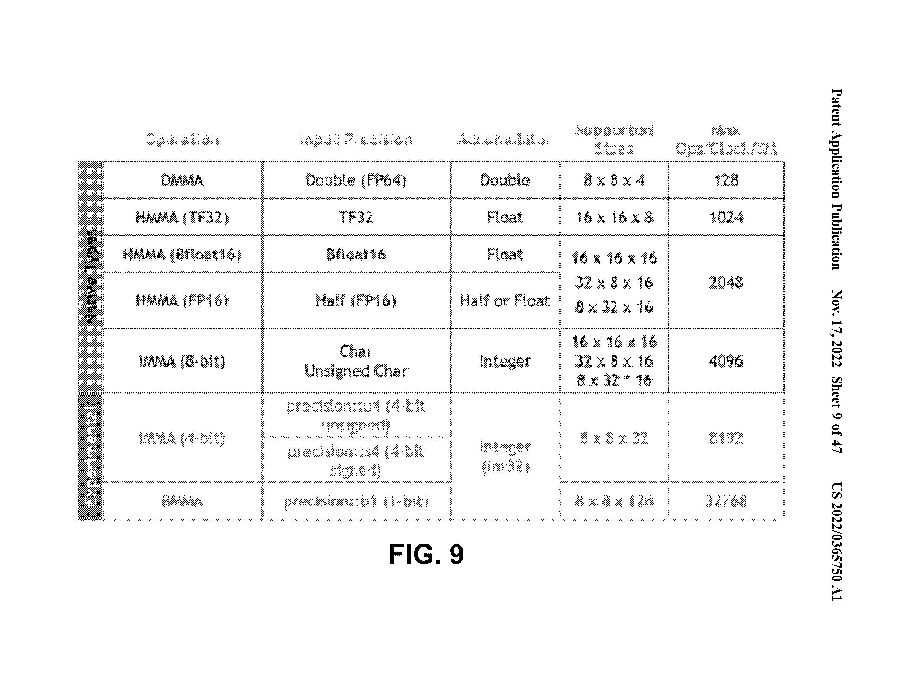
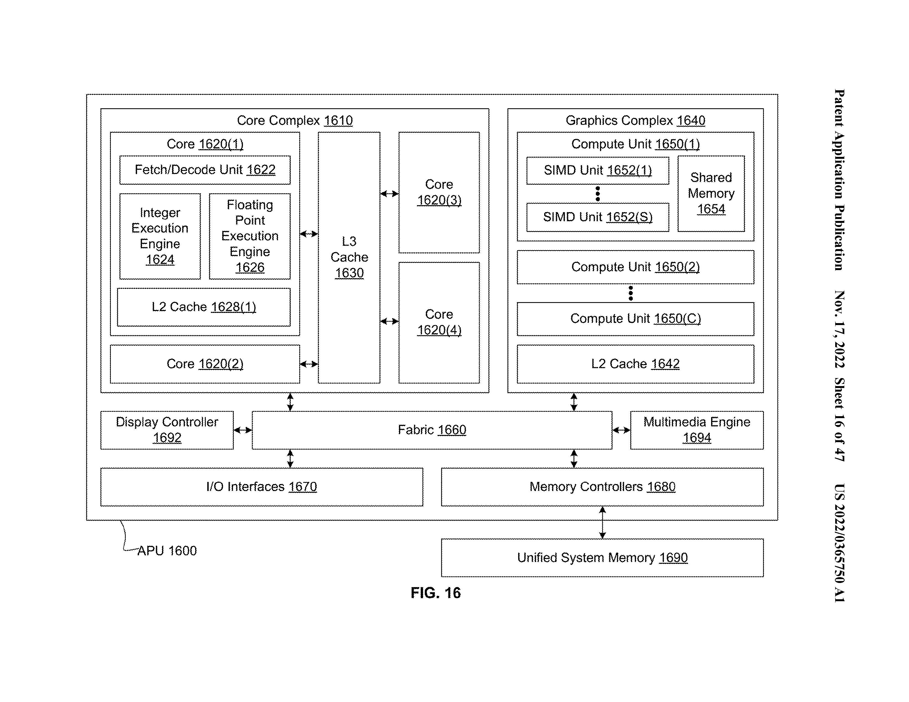
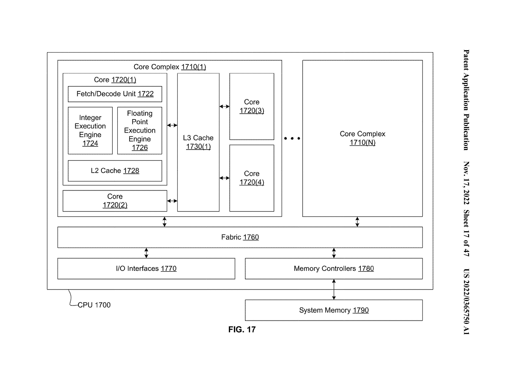
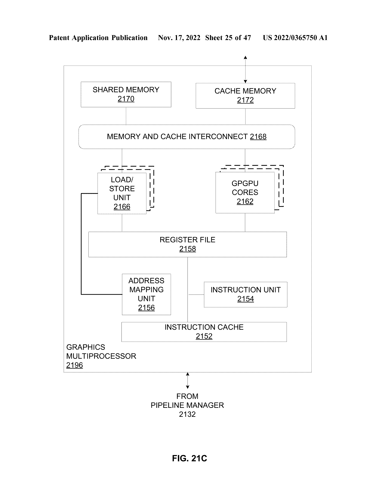
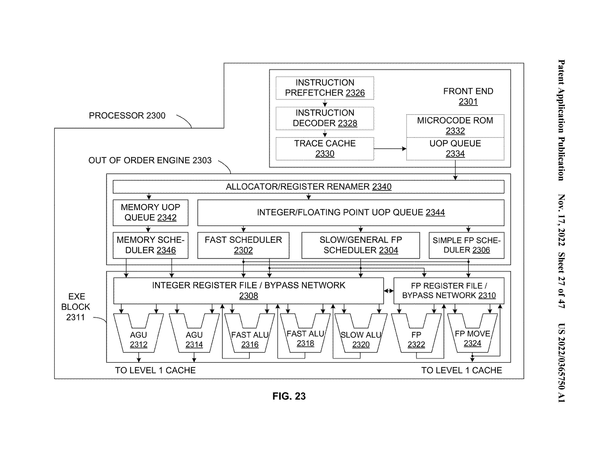
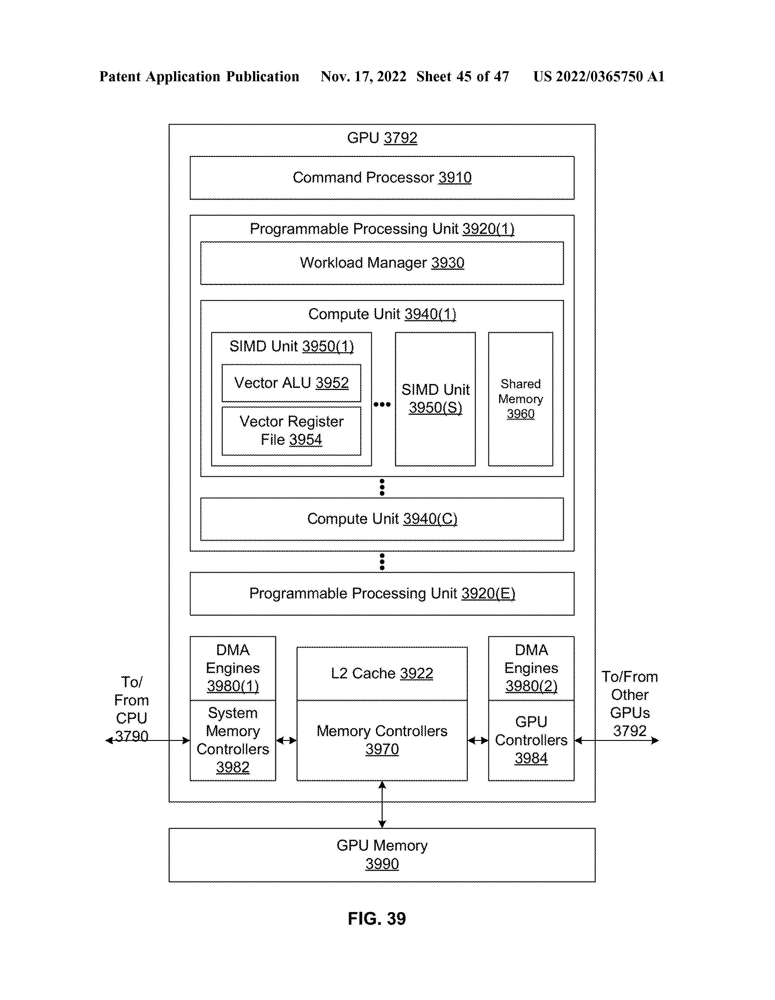
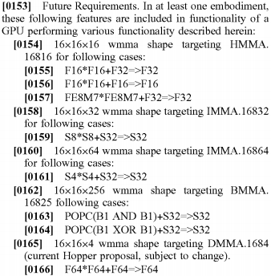
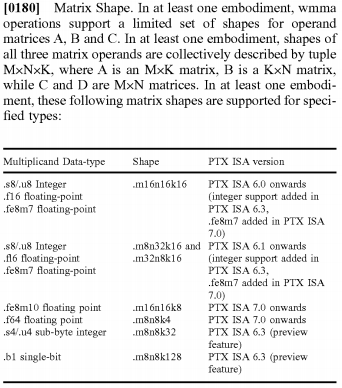

专利名称：[Datatype conversion technique](https://patents.google.com/patent/US20220365750A1)

这个专利的工作主要包括以下几个方面：

- 提出了一种数据类型转换技术，用于在执行矩阵乘法累加（MMA）操作时，将32位浮点数转换为其他格式，如TF32或Bfloat16，以提高性能和精度。
- 描述了一种或多种电路，可以根据一种或多种舍入属性，对MMA操作数进行截断，生成一种或多种舍入数。
- 描述了一种或多种电路，可以将舍入数转换为目标格式，并使用转换后的操作数执行MMA操作。
- 描述了一种或多种API，可以用于调用数据类型转换技术，并提供一种或多种参数，如舍入属性、操作数格式、操作数地址等。
- 描述了一种或多种编译器，可以用于将源代码中的MMA指令转换为相应的API调用，并根据目标设备的特性进行优化。
- 描述了一种或多种处理器或计算系统，可以执行数字生成和MMA操作，并包含上述的电路、API和编译器。

## 图片摘录

  

  

  

  

  

  

## 内容摘录

这篇专利只讲了wmma，没有提到mma。

  

  

