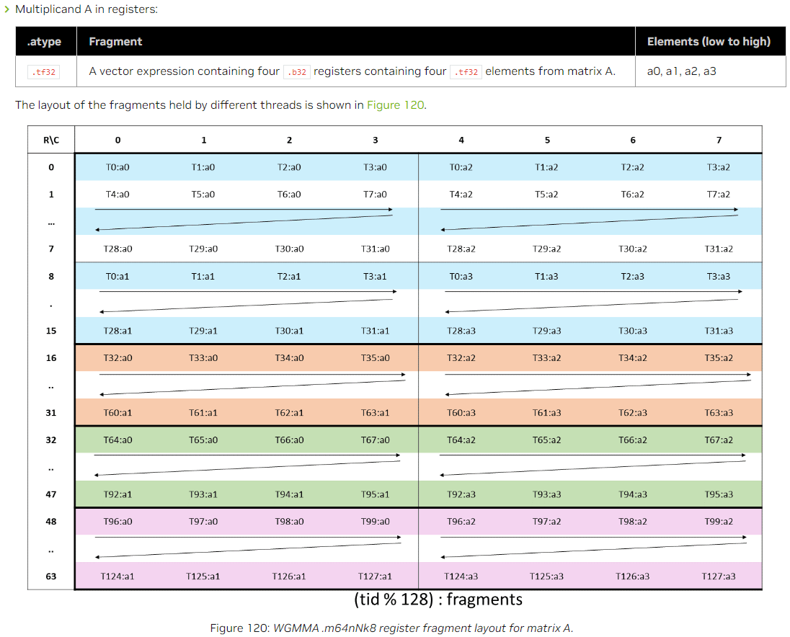
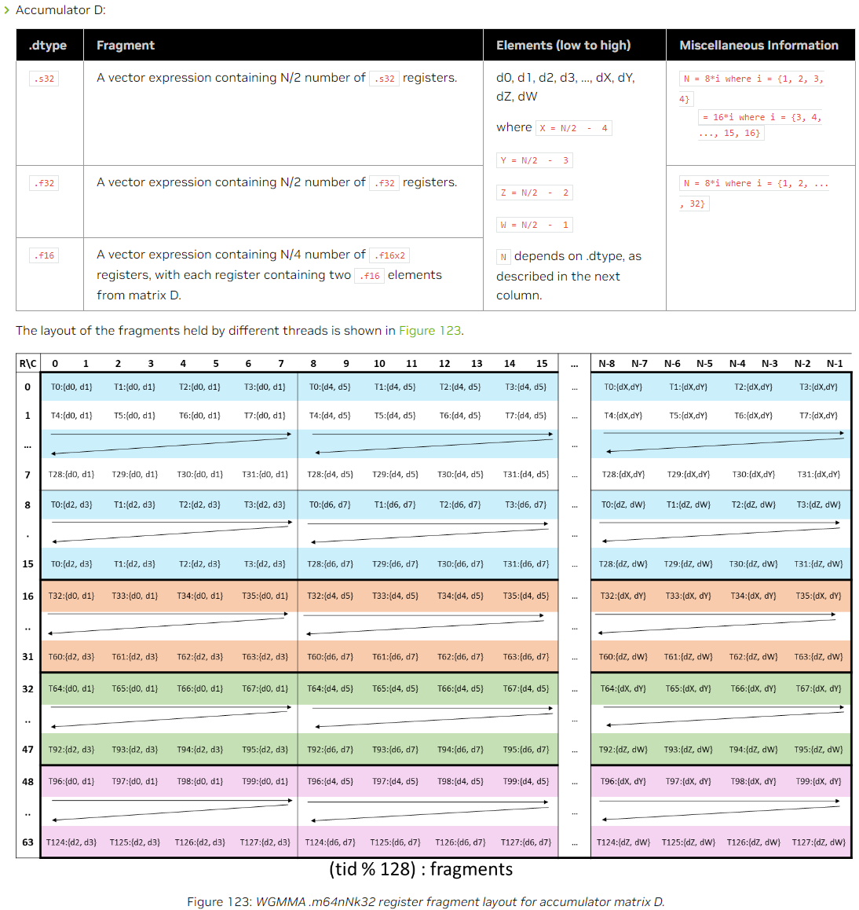

- [Asynchronous Warpgroup Level Matrix Multiply-Accumulate Instructions](#asynchronous-warpgroup-level-matrix-multiply-accumulate-instructions)
  - [定义](#定义)
  - [矩阵尺寸和数据类型](#矩阵尺寸和数据类型)
  - [Register Fragments and Shared Memory Matrix Layouts](#register-fragments-and-shared-memory-matrix-layouts)
    - [Register Fragments](#register-fragments)
    - [Shared Meomory Matrix Layout](#shared-meomory-matrix-layout)
  - [`wgmma.mma_async` 指令](#wgmmamma_async-指令)
- [Asynchronous wgmma Proxy Operations](#asynchronous-wgmma-proxy-operations)
  - [`wgmma.fence` 指令](#wgmmafence-指令)
  - [`wgmma.commit_group` 和 `wgmma.wait_group` 指令](#wgmmacommit_group-和-wgmmawait_group-指令)

## [Asynchronous Warpgroup Level Matrix Multiply-Accumulate Instructions](https://docs.nvidia.com/cuda/parallel-thread-execution/index.html#asynchronous-warpgroup-level-matrix-multiply-accumulate-instructions)

### 定义

wgmma进行运算：`D = A * B + D` 或 `D = A * B`。

The wgmma instructions perform warpgroup level matrix multiply-and-accumulate operation by having all threads in a warpgroup collectively perform the following actions:

1. Load matrices A, B and D into registers or into shared memory.
2. Perform the following fence operations:
   - `wgmma.fence` operations to indicate that the register/shared-memory across the warpgroup have been written into.
   - `fence.proxy.async` operation to make the generic proxy operations visible to the async proxy.
3. Issue the asynchronous matrix multiply and accumulate operations using the `wgmma.mma_async` operation on the input matrices. The `wgmma.mma_async` operation is performed in the async proxy.
4. Create a wgmma-group and commit all the prior outstanding `wgmma.mma_async` operations into the group, by using `wgmma.commit_group` operation.
5. Wait for the completion of the required wgmma-group.
6. Once the wgmma-group completes, all the `wgmma.mma_async` operations have been performed and completed.

### 矩阵尺寸和数据类型

  
  

### Register Fragments and Shared Memory Matrix Layouts

A可以来自register或shared memory，B必须来自shared memory。在shared memory中的矩阵的地址必须对齐16字节。

#### Register Fragments

**m64nNk16，其中N来自上面的矩阵尺寸的表格**

  
  

**m64nNk8**

  
  

**m64nNk32**

  
  

**m64nNk256**

  
  

#### Shared Meomory Matrix Layout

shared memory中的矩阵以“core matrix”为单位存储。每个core matrix在shared memory中地址连续，有8行（或列），每行16 bytes。

Matrix A is made up of 8x2 core matrices and Matrix B is made up of 2x(N/8) core matrices. This section describes the layout of the core matrices for each shape.

**m64nNk16**

  

以下是A和B的core matrix的layout，每个编号代表了core matrix的一个元素：

  
  

**m64nNk8**

  
  
  

**m64nNk32**

  
  
  

**m64nNk256**

  
  
  

**stride**

在shared memory中存储的矩阵有两个stride属性：  
Leading dimension byte offset of matrix A or B is the distance, in bytes, between two adjacent core matrices in the K dimension.  
Stride dimension byte offset of matrix A or B is the distance, in bytes, between two adjacent core matrices in the M or N dimension.

  
  

**Swizzling Modes**

可以指定core matrix的混合存储排布方式。

  
  
  
  

### `wgmma.mma_async` 指令

**Syntax**

Half precision floating point type:

```ptx
wgmma.mma_async.sync.aligned.shape.dtype.f16.f16  d, a-desc, b-desc, scale-d, imm-scale-a, imme-scale-b, imm-trans-a, imm-trans-b;

wgmma.mma_async.sync.aligned.shape.dtype.f16.f16  d, a, b-desc, scale-d, imm-scale-a, imme-scale-b, imm-trans-b;

.shape   = {.m64n8k16, .m64n16k16, .m64n24k16, .m64n32k16,
            .m64n40k16, .m64n48k16, .m64n56k16, .m64n64k16,
            .m64n72k16, .m64n80k16, .m64n88k16, .m64n96k16,
            .m64n104k16, .m64n112k16, .m64n120k16, .m64n128k16,
            .m64n136k16, .m64n144k16, .m64n152k16, .m64n160k16,
            .m64n168k16, .m648176k16, .m64n184k16, .m64n192k16,
            .m64n200k16, .m64n208k16, .m64n216k16, .m64n224k16,
            .m64n232k16, .m64n240k16, .m64n248k16, .m64n256k16};
.dtype   = {.f16, .f32};
```

Alternate floating point type :

```ptx
.bf16 floating point type:

wgmma.mma_async.sync.aligned.shape.dtype.bf16.bf16  d, a-desc, b-desc, scale-d, imm-scale-a, imme-scale-b, imm-trans-a, imm-trans-b;

wgmma.mma_async.sync.aligned.shape.dtype.bf16.bf16  d, a, b-desc, scale-d, imm-scale-a, imme-scale-b, imm-trans-b;

.shape   = {.m64n8k16, .m64n16k16, .m64n24k16, .m64n32k16,
            .m64n40k16, .m64n48k16, .m64n56k16, .m64n64k16,
            .m64n72k16, .m64n80k16, .m64n88k16, .m64n96k16,
            .m64n104k16, .m64n112k16, .m64n120k16, .m64n128k16,
            .m64n136k16, .m64n144k16, .m64n152k16, .m64n160k16,
            .m64n168k16, .m648176k16, .m64n184k16, .m64n192k16,
            .m64n200k16, .m64n208k16, .m64n216k16, .m64n224k16,
            .m64n232k16, .m64n240k16, .m64n248k16, .m64n256k16};
.dtype  = {.f32};

.tf32 floating point type:

wgmma.mma_async.sync.aligned.shape.dtype.tf32.tf32  d, a-desc, b-desc, scale-d, imm-scale-a, imme-scale-b;

wgmma.mma_async.sync.aligned.shape.dtype.tf32.tf32  d, a, b-desc, scale-d, imm-scale-a, imme-scale-b;

.shape   = {.m64n8k8, .m64n16k8, .m64n24k8, .m64n32k8,
            .m64n40k8, .m64n48k8, .m64n56k8, .m64n64k8,
            .m64n72k8, .m64n80k8, .m64n88k8, .m64n96k8,
            .m64n104k8, .m64n112k8, .m64n120k8, .m64n128k8,
            .m64n136k8, .m64n144k8, .m64n152k8, .m64n160k8,
            .m64n168k8, .m648176k8, .m64n184k8, .m64n192k8,
            .m64n200k8, .m64n208k8, .m64n216k8, .m64n224k8,
            .m64n232k8, .m64n240k8, .m64n248k8, .m64n256k8};
.dtype  = {.f32};

FP8 floating point type

wgmma.mma_async.sync.aligned.shape.dtype.atype.btype  d, a-desc, b-desc, scale-d, imm-scale-a, imme-scale-b;

wgmma.mma_async.sync.aligned.shape.dtype.atype.btype  d, a, b-desc, scale-d, imm-scale-a, imme-scale-b;

.shape   = {.m64n8k32, .m64n16k32, .m64n24k32, .m64n32k32,
            .m64n40k32, .m64n48k32, .m64n56k32, .m64n64k32,
            .m64n72k32, .m64n80k32, .m64n88k32, .m64n96k32,
            .m64n104k32, .m64n112k32, .m64n120k32, .m64n128k32,
            .m64n136k32, .m64n144k32, .m64n152k32, .m64n160k32,
            .m64n168k32, .m648176k32, .m64n184k32, .m64n192k32,
            .m64n200k32, .m64n208k32, .m64n216k32, .m64n224k32,
            .m64n232k32, .m64n240k32, .m64n248k32, .m64n256k32};
.atype  = {.e4m3, .e5m2};
.btype  = {.e4m3, .e5m2};
.dtype  = {.f16, .f32};
```

Integer type:

```ptx
wgmma.mma_async.sync.aligned.shape{.satfinite}.s32.atype.btype  d, a-desc, b-desc, scale-d;

wgmma.mma_async.sync.aligned.shape{.satfinite}.s32.atype.btype  d, a, b-desc, scale-d;

.shape   = {.m64n8k32, .m64n16k32, .m64n24k32, .m64n32k32,
            .m64n48k32, .m64n64k32, .m64n80k32, .m64n96k32,
            .m64n112k32, .m64n128k32, .m64n144k32, .m64n160k32,
            .m648176k32, .m64n192k32, .m64n208k32, .m64n224k32};
.atype  = {.s8, .u8};
.btype  = {.s8, .u8};
```

Single bit:

```ptx
wgmma.mma_async.sync.aligned.shape.s32.b1.b1.op.popc  d, a-desc, b-desc, scale-d;

wgmma.mma_async.sync.aligned.shape.s32.b1.b1.op.popc  d, a, b-desc, scale-d;

.shape   = {.m64n8k256, .m64n16k256, .m64n24k256, .m64n32k256,
            .m64n48k256, .m64n64k256, .m64n80k256, .m64n96k256,
            .m64n112k256, .m64n128k256, .m64n144k256, .m64n160k256,
            .m648176k256, .m64n192k256, .m64n208k256, .m64n224k256};
.op  = {.and};
```

当 `scale-d` 为0，执行的是 `D = A * B` 而不是 `D = A * B + D` 运算。

上述格式中，`-desc` 表示数据在shared memory中，用一个 `matrix descriptor` 表示，这个64比特的descriptor定义如下：

  

A和B默认分别是row-major和column-major。`imm-trans-` 选项可以将它们设置为转置。这个选项仅在.f16、.bf16中支持。

`imm-scale-` 选项可以为1或-1。设置为-1则将数据变为负值，设置为1是正常情形。

在浮点数且除FP8之外的情形下，`.atype` 和 `.btype` 必须相同。

**PTX ISA Notes**

Introduced in PTX ISA version 8.0.

**Target ISA Notes**

Requires sm_90a.

`wgmma.fence` instruction must be used to fence the register accesses of wgmma.mma_async instruction from their prior accesses. Otherwise, the behavior is undefined.

`wgmma.commit_group` and `wgmma.wait_group` operations must be used to wait for the completion of the asynchronous matrix multiply and accumulate operations before the results are accessed.

## Asynchronous wgmma Proxy Operations

### `wgmma.fence` 指令

用来保证内存一致性。

必须在以下情形使用fence指令：

- Before the first wgmma.mma_async operation in a warpgroup.
- Between a register access by a thread in the warpgroup and any wgmma.mma_async instruction that accesses the same registers, either as accumulator or input register containing fragments of matrix A, except when these are accumulator register accesses across multiple wgmma.mma_async instructions of the same shape. In the latter case, an ordering guarantee is provided by default.

**PTX ISA Notes**

Introduced in PTX ISA version 8.0.

**Target ISA Notes**

Requires sm_90a.

**Examples**

```ptx
// Example 1, first use example:
wgmma.fence.sync.aligned;    // Establishes an ordering w.r.t. prior accesses to the registers s32d<0-3>
wgmma.mma_async.sync.aligned.m64n8k32.s32.u8.u8  {s32d0, s32d1, s32d2, s32d3},
                                                  descA, descB, scaleD;
wgmma.commit_group.sync.aligned;
wgmma.wait_group.sync.aligned 0;

// Example 2, use-case with the input value updated in between:
wgmma.fence.sync.aligned;
wgmma.mma_async.sync.aligned.m64n8k32.s32.u8.u8  {s32d0, s32d1, s32d2, s32d3},
                                                  descA, descB, scaleD;
...
mov.b32 s32d0, new_val;
wgmma.fence.sync.aligned;
wgmma.mma_async.sync.aligned.m64n8k32.s32.u8.u8  {s32d4, s32d5, s32d6, s32d7},
                                                 {s32d0, s32d1, s32d2, s32d3},
                                                  descB, scaleD;
wgmma.commit_group.sync.aligned;
wgmma.wait_group.sync.aligned 0;
```

### `wgmma.commit_group` 和 `wgmma.wait_group` 指令

`commit_group` 主要用于将一组相关的wgmma.mma_async操作捆绑到一个wgmma-group中，以便进行批量提交和同步。

`wait_group` 主要用于在执行线程之间创建同步点，以确保在继续执行之前等待特定数量的wgmma-groups完成。

总结区别：wgmma.fence用于控制内存访问的顺序，wgmma.commit_group用于捆绑和提交wgmma.mma_async操作，而wgmma.wait_group用于等待特定数量的wgmma-groups完成以创建同步点。

**PTX ISA Notes**

Introduced in PTX ISA version 8.0.

**Target ISA Notes**

Requires sm_90a.

**Examples**

```ptx
wgmma.fence.sync.aligned;

wgmma.mma_async.sync.aligned.m64n8k32.s32.u8.u8  {s32d0, s32d1, s32d2, s32d3},
                                                  descA, descB, scaleD;
wgmma.commit_group.sync.aligned;

wgmma.mma_async.sync.aligned.m64n8k16.f32.f16.f16 {f32d0, f32d1, f32d2, f32d3},
                                                  {f16a0, f16a1, f16a2, f16a3},
                                                   descB, 1, -1, -1, 1;
wgmma.commit_group.sync.aligned;

wgmma.wait_group.sync.aligned 0;
```
