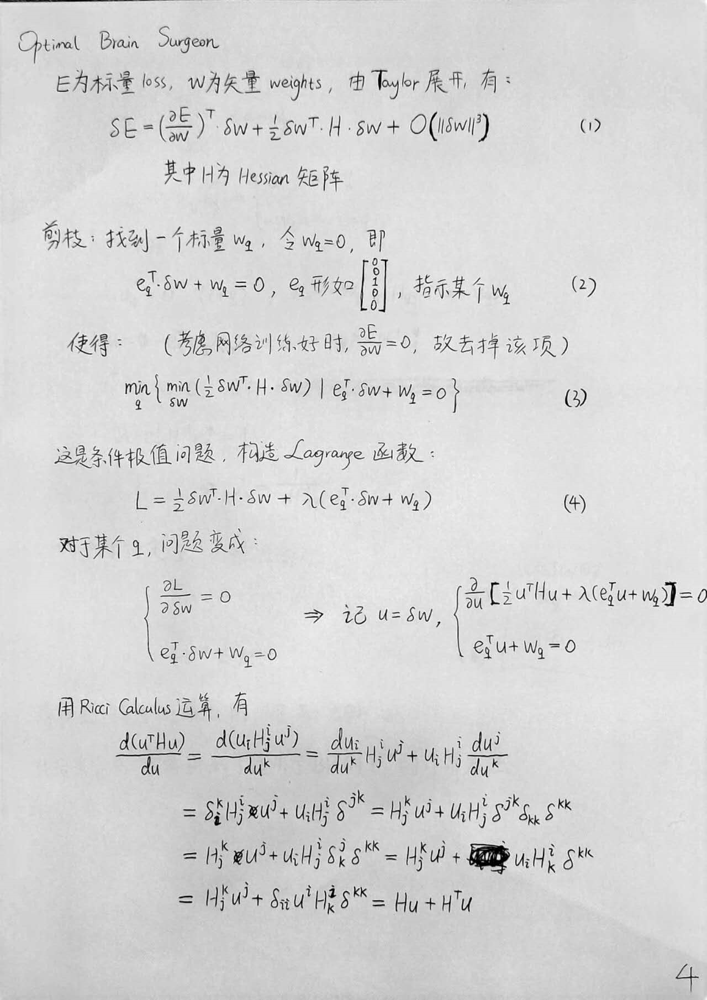
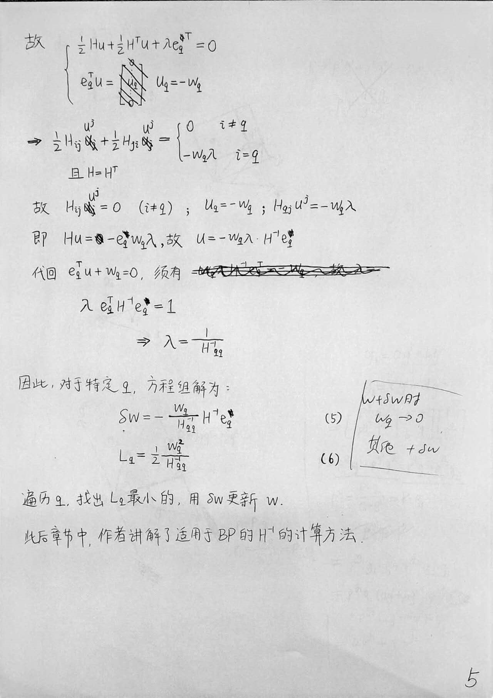
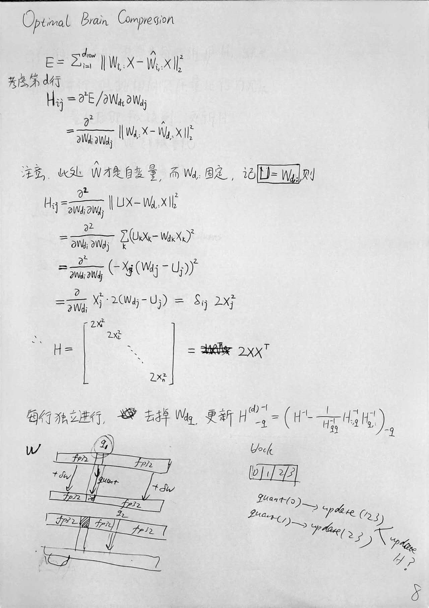
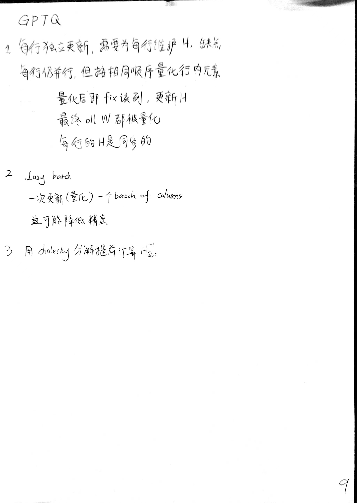

## Optimal Brain Surgeon (OBS)

首先是这篇1993年的论文（其实在这之前还有一篇1989年的，但从这篇开始也够了）

  
  

## Optimal Brain Compression

然后是这篇2022年的论文，用了OBS的核心算法，做了Sparsity和量化。

  

## GPTQ

而2023年的GPTQ则是对Optimal Brain Compression中的量化方法的改进。

  
